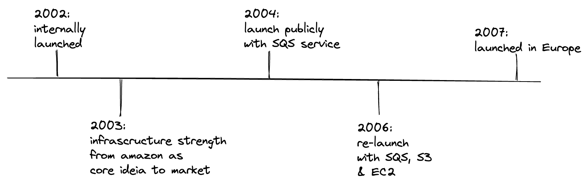

= AWS Architect Associate & Professional Certifications

- Including Stacks

* Java v17
* Quarkus 3.x
* Terraform 1.4.x
* Apache Camel 4.x

== Links

- https://quarkus.io/[Quarkus]
- https://camel.apache.org/camel-quarkus/next/index.html[Camel Ext4Quarkus]
- https://aws.amazon.com/about-aws/global-infrastructure/regional-product-services[Region Service Table]

== Associated Certification

=== Concepts

.AWS Timeline

. AWS enables you to build sophisticated and scalable applications
. How to choose AWS Regions: its depends
.. Compliance with data governance and legal requirements: data never leaves a regions without your explicit permission
.. Proximity to reduce latency
.. Kinds of available services within a Region
.. Pricing all check price

. AWS Common Global Services

* Identity and Access Management (IAM)
* Route 53 (DNS Service)
* Cloud Front (Content Delivery Network)
* WAF (Web Application Firewall)

. AWS Services Common Region Services

* AWS EC2 (IaaS)
* Elastic Beans Talk (PaaS)
* Lambda (FaaS)

=== IAM & AWS CLI

* Users are people within an organization, and must be grouped
* Groups only contain users, not other groups

== Professional Certification

