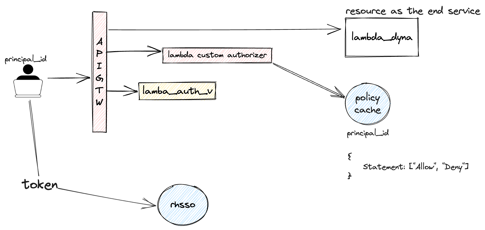

= AWS Architect Associate & Professional Certifications

- Including Stacks

* Java v17
* Quarkus 3.x
* Terraform 1.4.x
* Apache Camel 4.x

== Links

- https://quarkus.io/[Quarkus]
- https://camel.apache.org/camel-quarkus/next/index.html[Camel Ext4Quarkus]
- https://aws.amazon.com/about-aws/global-infrastructure/regional-product-services[Region Service Table]

== Associated Certification

=== Concepts

.AWS Timeline
image::thumbs/images/aws_history_timeline.png[]

. AWS enables you to build sophisticated and scalable applications
. How to choose AWS Regions: its depends
.. Compliance with data governance and legal requirements: data never leaves a regions without your explicit permission
.. Proximity to reduce latency
.. Kinds of available services within a Region
.. Pricing all check price

. AWS Common Global Services

* Identity and Access Management (IAM)
* Route 53 (DNS Service)
* Cloud Front (Content Delivery Network)
* WAF (Web Application Firewall)

. AWS Services Common Region Services

* AWS EC2 (IaaS)
* Elastic Beans Talk (PaaS)
* Lambda (FaaS)

=== IAM & AWS CLI

* Users are people within an organization, and must be grouped
* Groups only contain users, not other groups
* MFA is a combination of password with security device you own

.Lambda Authorizer Concept

.Sample use S3 API using AWS CLI
[source,bash]
----
aws s3api list-buckets
----

* IAM Roles for Services, assign permissions to AWS Services with IAM Roles, e.g some EC2 instance needs access Lambda

* Quick summary for IAM

- Users: mapped to a physical user, has a password for AWS Console
- Groups: contains only users
- Policies: JSON document that outlines permissions for users or groups
- Roles: for AWS EC2 instances or AWS Services
- Security: MFA + Password Policy
- Grant Least Privilege
- IAM Credentials Report is a Security Tool

=== EC2 Fundamentals

* Used in everywhere and means Elastic Compute Cloud
* Composed by many definitions such as:
. Virtual Machines (Ec2 Instances),
. Storing data (EbS & EfS)
. Distributing loads across machines (ElB)
. Scaling the instances using auto-scaling group (ASG)

. EC2 Instance types: https://aws.amazon.com/ec2/instance-types[Ec2 Instance Types], we can check specific instances vantages on https://instances.vantage.sh[Instances Vantages]

* Security Group plays a critical role over AWS network, they control how the traffic (firewall) is allowed into or out of our EC2 instance, sg (security groups) can be also referenced between them using inbound/outbound concepts

* *_Never ever_*, runs *_aws configure_* inside an EC2 instance *NEVER*, instead of use IAM Policies

=== Private vs Public Network (IPv4)

* Networking in AWS can define IPs over IPv4 and/or IPv6; IPv4 _1.160.10.240_ - IPv6 _3ff3:1900:4545:3:200:f8ff:fe21:67c7_
* In private Network, all the computers / servers can talk to one another using private IPs, after attaching IGW Internet Gateway,__ these server instances can talk with public internet

.IGW Public Communication
image::thumbs/images/aws_private_network.png[]

* Public IP must be unique across the whole internet
* Private IP can be identified and used only inside a private network
* EC2 has ephemeral ip, but we can use elastic ip to keep the same value
* In general *_don't use Elastic IPs_*

=== Placement Groups

* Control EC2 Instances (Same Rack, hardware, and Same AZ) using some different strategies such as _Cluster_, _Spread_ and _Partition._
* Cluster low-network latency but need willing to take the risk when the rack fails, all the instances will stop also
* Spread low fail risk over split instances among AZs, but have limitation to 7 instances per AZ
* Partition instances in multiples instances but not all isolated

=== Elastic Network Interfaces (ENI)

* Logical components in a VPC that represents a virtual network card, eth0 attached in an EC2 instance, with one or secondary IPv4, mac address

* Which scenario we need a 2 ENIs with private IPS?
The same application in multiple instances can be accessed using two different ENIs, but ENis cannot be attached across AZs

.Using ENI Concept Attach in
image::thumbs/images/AWS_ENI_Concept.png[]

== Professional Certification

* AWS Organization

. SCPs or *_Service control policy_* is a type of control policy that you can use to centrally control the maximum available *permissions granularity* for all accounts over an organization unit (OU)

.AWS Organization Structure overview
image::thumbs/images/aws_organizations_structure.png[]

.SCPs Maximum Available Permission
[source,json]
----
{
  "Version": "2012-10-17",
  "Statement": [
      {
        "Effect": "Allow",
        "Action": "*",
        "Resource": "*"
      }
  ]
}
----

.SCP PowerUserAccess
[source,json]
----
{
  "Version": "2012-10-17",
  "Statement": [
    {
      "Effect": "Allow",
      "NotAction": [
        "iam:*",
        "organizations:*",
        "account:*"
      ],
      "Resource": "*"
    },
    {
      "Effect": "Allow",
      "Action": [
        "iam:CreateServiceLinkedRole",
        "iam:DeleteServiceLinkedRole",
        "iam:ListRoles",
        "organizations:DescribeOrganization",
        "account:ListRegions"
      ],
      "Resource": "*"
    }
  ]
}
----

. *_Tag Policy_* applied to enforce tag standardization, over other accounts e.g; HML Account

.SCPs Hierarchy Representation
[source,html]
----
|- root
|-|- [ou1]
|-|-|- dev-account
|-|-|-|- [ou2]
|-|-|-|-|- prod-account
----

* _FullAWSAccess_ SCP by default allows everything, SCPs list must be created to deny

.Enabling Service Control policy Over Organization
[source,json]
----
{
  "Version": "2012-10-17",
  "Statement": [
      {
        "Sid": "RequirementInstanceType",
        "Effect": "Deny",
        "Action": "ec2:RunInstances",
        "Resource": "arn:aws:ec2:*:*:instance/*",
        "Condition": {
          "StringNotEquals": {
            "ec2:InstanceType": "t2.micro"
          }
        }
      }
  ]
}
----

* After creating this policy, it must be attached over OUs tree; in this case using our tree, ou2 will inherit the same SCP, *_over your tree scenario neither DEV-OU1 nor PROD-OU2 can create ec2:instances different from t2:micro_*

.SCP EC2 Instance Launch Error
image::thumbs/images/scp_ec2_launch_instance_error.png[]

- https://github.com/aws-samples/aws-scps-with-terraform[SCPs with Terraform GitHub Sample]

* Control Tower stays on the top of the organization and provides you some additional control, it integrates with a Directory Source over Single Sign On with SAML 2.0 or Microsoft AD, detective guardrails are used to governance and compliance

=== Identity & Federation

==== IAM

* Over EC2 instance roles: use the _EC2 metadata_ service.
One role at a time per instance

* Role is a short-term credentials, uses STS
* Policies AWS Managed, Customer Managed or Inline
* Resources Based Policies (S3 Bucket, etc..)

[source,json]
----
{
  "Version": "2012-10-17",
  "Statement": [
    {
      "Effect": "Allow",
      "Action": [
        "ec2:AttachVolume",
        "ec2:DetachVolume"
      ],
      "Resource": "arn:aws:ec2:*:*:instance/*",
      "Condition": {
        "StringEquals": {
          "ec2:ResourceTag/Department": "Development"
        }
      }
    },
    {
      "Effect": "Allow",
      "Action": [
        "ec2:AttachVolume",
        "ec2:DetachVolume"
      ],
      "Resource": "arn:aws:ec2:*:*:volume/*",
      "Condition": {
        "StringEquals": {
          "ec2:ResourceTag/VolumeUser": "${aws:username}"
        }
      }
    }
  ]
}
----

.Conditions Structure Schema
[source,json]
----
{
  "Conditions": {"{condition-operator}":  {
    "{condition-key}": "{condition-value}"
  }}
}
----

.Conditions Operators
[source,html]
----
String (StringEquals, StringNotEquals, StringLike,...)
 * Condition: { "StringLike": {"s3:prefix": ["", "home/", "home/${aws:username}/"]}}
Numeric (NumericEquals, NumericNotEquals, NumericLessThan,...)
Date..
Bool
(Not)IpAddress
 * Condition: {"IpAddress": {"aws:SourceIp": "203.0.113.0/24}}
ArnEquals:
Null:
----

* Best Practice: use least privileges for Maximum security
** Access Advisor: see permissions granted and when last accessed
** Access Analyser: Analyze resources that are shared with external entity

.IAM Roles vs Resource Based Policies
image::thumbs/images/IAM_Roles_vs_ResourceBasedPolicies.png[]

. Using assume role (user, application or Service), you give up your original permission and take the permissions assigned to the role
. Using resource-based policy, the principal doesn't have to give up any permissions

. Example: User in _Account A_ needs to _scan_ a DynamoDB table in _Account A_ and _dump_ it in a S3 bucket in _Account B_

.. IAM ROLE in account A to allow scan action, after we need also a resource policy on the S3 bucket on account B

==== IAM Analyzer

. Find out which resources are shared externally, delimited by Zone of trust (AWS Boundary)

. Cloudtrail logs are reviewed to generate the policy with the fine-grained permissions and the appropriate Actions and Services

.IAM Analyzer with Policy Generation
image::thumbs/images/IAM_Analyzer_actions.png[]