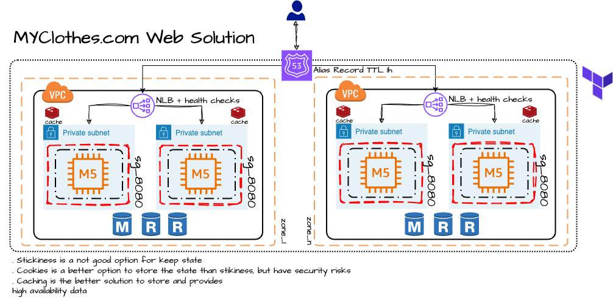

= AWS Architect Associate & Professional Certifications

== Links

- https://aws.amazon.com/about-aws/global-infrastructure/regional-product-services[Region Service Table]

== Associated Certification

=== Solutions Architecture Solutions

.WhatsTheTime App
image::thumbs/images/saa_certificate_solutions_whatisthetime.png[]

.MyClothes App

=== Concepts

.AWS Timeline
image::thumbs/images/aws_history_timeline.png[]

. AWS enables you to build sophisticated and scalable applications
. How to choose AWS Regions: its depends
.. Compliance with data governance and legal requirements: data never leaves a regions without your explicit permission
.. Proximity to reduce latency
.. Kinds of available services within a Region
.. Pricing all check price

. AWS Common Global Services

* Identity and Access Management (IAM)
* Route 53 (DNS Service)
* Cloud Front (Content Delivery Network)
* WAF (Web Application Firewall)

. AWS Services Common Region Services

* AWS EC2 (IaaS)
* Elastic Beans Talk (PaaS)
* Lambda (FaaS)

=== IAM & Fundamentals

* IAM (_Identity and Access Management_) is as global service, identities can be classified as humans and non-humans
* Root account created by default, but never ever should be used or shared
* Users are people within an organization, and must be grouped
* Groups only contain users, not other groups
* Always apply the [.underline]#*_least privilege principle_*#, that means, don't give more or any permissions that a user really needs
* Policies in a group will be applied in everyone inside this group

.IAM Policy Structure
[source,json]
----
{
  "Version": "2012-10-17",
  "Id": "S3-Account-Permission",
  "Statement": [
      {
        "Sid": "1",
        "Effect": "Allow",
        "Principal": {
          "AWS": ["arn:aws:iam::123456:root"]
        },
        "Action": [
          "s3:GetObject",
          "s3:PutObject"
        ],
        "Resource": ["arn:aws:s3:::mybucket/*"],
        "Condition": {
          "StringEquals": ""
        }
      }
  ]
}
----

* #Principal can be composed by of account/user/role#
* We can attach direct policies for a user, or even create an inline policy

.ARN User
[source,html]
----
arn:aws:iam:855174569821:user/dougdb
----

.IAMReadOnlyAccess Policy Sample
[source,json]
----
{
  "Version": "2012-10-17",
  "Statement": [
      {
        "Effect": "Allow",
        "Action": [
          "iam:GenerateCredentialReport",
          "iam:GenerateServiceLastAccessedDetails",
          "iam:Get*",
          "iam:List*",
          "iam:SimulateCustomPolicy",
          "iam:SimulatePrincipalPolicy"
        ],
        "Resource": "*"
      }
  ]
}
----

* #IAM Roles for Services#, assign permissions to AWS Services with IAM Roles, e.g., some EC2 instance needs access Lambda
* Instance Profile: works such as box for an iam role, can be used to pass role information to an EC2 instance, will be automatically created when a role is attached in EC2 Instance
* Identity-based vs Resource-based policies: policies attached to services, e.g.: Bucket ACL, by default, only the account owner has access to S3 bucket, here we can classify as Identity, as Resource-based is a role attached to a service (S3)
* IAM Cross Account: when a different account needs to perform some actions in your account
* IAM Roles are classified as:
** _AWS Services_: Allow AWS services like EC2, Lambda or other to perform actions in this account, most common use cases are EC2 and Lambda
** _AWS Account_: Allow entities in other AWS accounts belonging to you or 3rd party to perform actions in this account
** _Web Identity_: Allows users federated by the specified external web identity provider to assume this role to perform actions in this account
** _SAML 2.0 federation_: Allow users federated with SAML 2.0 from a corporate directory to perform actions in this account
** _Custom trust policy_: Create a custom trust policy to enable others to perform actions in this account

* Quick summary for IAM

- Users: mapped to a physical user, has a password for AWS Console
- Groups: contains only users
- Policies: JSON document that outlines permissions for users or groups
- Roles: for AWS EC2 instances or AWS Services
- Security: MFA + Password Policy
- Grant Least Privilege
- IAM Credentials Report is a Security Tool

=== EC2 Fundamentals

* Used in everywhere and means Elastic Compute Cloud
* Composed by many definitions such as:
. Virtual Machines (Ec2 Instances),
. Storing data (EbS & EfS)
. Distributing loads across machines (ElB)
. Scaling the instances using auto-scaling group (ASG)

. EC2 Instance types: https://aws.amazon.com/ec2/instance-types[Ec2 Instance Types], we can check specific instances vantages on https://instances.vantage.sh[Instances Vantages]

* Security Group plays a critical role over AWS network, they control how the traffic (firewall) is allowed into or out of our EC2 instance, sg (security groups) can be also referenced between them using inbound/outbound concepts

* Custom AMIs to optimize setups - https://blog.devops.dev/create-aws-ec2-instance-using-terraform-with-custom-ubuntu-amazon-machine-image-ami-having-f0b58c79864a[Custom AMI with TF]

* *_Never ever_*, runs *_aws configure_* inside an EC2 instance *NEVER*, instead of use IAM Policies

=== Private vs Public Network (IPv4)

* Networking in AWS can define IPs over IPv4 and/or IPv6; IPv4 _1.160.10.240_ - IPv6 _3ff3:1900:4545:3:200:f8ff:fe21:67c7_
* In private Network, all the computers / servers can talk to one another using private IPs, after attaching IGW Internet Gateway,__ these server instances can talk with public internet

.IGW Public Communication
image::thumbs/images/aws_private_network.png[]

* Public IP must be unique across the whole internet
* Private IP can be identified and used only inside a private network
* EC2 has ephemeral ip, but we can use elastic ip to keep the same value
* In general *_don't use Elastic IPs_*

=== Placement Groups

* Control EC2 Instances (Same Rack, hardware, and Same AZ) using some different strategies such as _Cluster_, _Spread_ and _Partition._
* Cluster low-network latency but need willing to take the risk when the rack fails, all the instances will stop also
* Spread low fail risk over split instances among AZs, but have limitation to 7 instances per AZ
* Partition instances in multiples instances but not all isolated

=== Elastic Network Interfaces (ENI)

* Logical components in a VPC that represents a virtual network card, eth0 attached in an EC2 instance, with one or secondary IPv4, mac address

* Which scenario we need a 2 ENIs with private IPS?
The same application in multiple instances can be accessed using two different ENIs, but ENis cannot be attached across AZs

.Using ENI Concept Attach in
image::thumbs/images/AWS_ENI_Concept.png[]

.Sample use S3 API using AWS CLI
[source,bash]
----
aws s3api list-buckets
----

=== EC2 Instance Storage (EBS CSi)

* EBS (Elastic block storage) volume is a *network drive* you can attach to your instances; it allows us to persist the data even after the instance terminates they can be mounted just to one instance at a time, *_they are bound to a specific availability zone_*, that means it cannot be attached in different zones

* We can attach two different EBS Volumes attached at the same instance

* They are locked to an Availability Zone (AZ), e.g.; an _EBS_ volume in _us-east-1a_ cannot be attached to _us-east-1b_

* Snapshots make a backup (snapshot) of your EBS volume, not the necessary detached volume, but is recommended to do it, can copy snapshots across AZ or region

* EBS are network drives, but with limited performance, to improve this u can create an EC2 Instance Store, better I/O performance, can be good for buffer/cache/temp data, but instance store loses their storage if they're stopped by (ephemeral behavior)

* EBS Volumes types

** gp2/gp3 (SSD) General purpose volume
** iol/io2 (SSD) highest-performance SSD volume
** stl (HDD) low cost HDD volume
** scl (HDD) the lowest cost using HDD, used to be less frequently accessed

* EBS Multi-attach over iol/io2 family *is possible to attach the same EBS volume to multiple EC2 instances in the same AZ*

* EBS Encryption is possible to protect all the data stored even over snapshots, all the encryption is transparent and handled by EC2 and EBS, with minimal impact on latency

.EBS Volume TF sample
[source,hcl-terraform]
----
resource "aws_volume_attachment" "my_ec2" {
  count = var.instances_number

  device_name = "/dev/sdh"
  volume_id   = aws_ebs_volume.ebs.id
  instance_id = module.ec2.id
}

resource "aws_ebs_volume" "ebs" {
  count = var.instances_number

  availability_zone = module.ec2.availability_zone
  size              = 10 // GiB
}
----

=== Amazon EFS

* Managed NFS (network file system), then can be mounted on many EC2 over multi-az, and scaled up automatically
* EFS works with EC2 instances in multi-AZ, scalable but expensive (3x gp2 w/ pay per use), can be used to web serving, data sharing
* It uses NFSv4.1 protocol
* Use _Security Group_ to control access to EFS, only compatible with Linux OS, can be encrypted using KMS
* Can be classified as Standard for frequent access and infrequent (EFS-IA) const to retrieve files, lower price to store

* https://github.com/terraform-aws-modules/terraform-aws-efs/blob/v1.2.0/examples/complete/main.tf[TF EFS Creation Sample] using EFS over Terraform

=== High Availability and Scalability: ELB & ASG

* There are two kinds of scalability:
** Vertical and Horizontal scalability, #_on the vertical side we've a t2.medium scaled up to the u-l2tbl.metal machine_# this is hardware/physical improvement, #_on the horizontal side we're replicating the same instance multiple times_# using scale-out (increase instances) and scale-in (decrease instances)

==== Load balancers

* Servers just to forward the traffic to multiple target servers, e.g.; _EC2 instances_, to spread loads across multiple instances with single point of access (DNS), with regular health checks, handling HTTP/s connections

* AWS provide _4 kinds ALB models_
. Classic Load Balancer - [CLB] HTTP/s, TCP, SSL
. Application Load Balancer - [ALB] HTTP/s, WebSocket
. Network Load Balancer - [NLB] TCP, TLS, UDP
. Gateway Load Balancer [GWLB] Operates at Layer IP Protocol

* Load balancers use security groups to allow traffic to control ports and protocol rules, #_an enhancement security action can be considered to use SG HTTP 80 a tied communication with ALB target_#

* SSL over Load Balancer, HTTPs Over www/ALB/HTTP over private VPC under X.509 certificate

* Deregistration delay - ALB & NLB, time to complete _in-flight requests_ while the instance is unregistering or unhelthy

.Application Load Balancer Layer 7 sample, more details https://github.com/DouglasGo8/terraform-onreal-aws/blob/main/iac-aws/sre-ec2/alb[ALB TF]
[source,hcl-terraform]
----
# Routing support query-string/hostname/path/headers
module "application-alb" {
  source             = "terraform-aws-modules/alb/aws"
  version            = "8.7.0"
  name               = "${local.name}-application-elb-http"
  #
  load_balancer_type = "application"
  vpc_id             = "data.vpc_id"
  subnets            = ["var.subnet_1.xxx", "var.subnet_2.yyy"]
  security_groups    = [module.application_alb_http_sg.security_group_id] # bastion host
  # Listeners
  http_tcp_listeners = [
    {
      port               = 80
      protocol           = "HTTP"
      target_group_index = 0 # TG Index = 0
    }
  ]
  # Target Groups
  target_groups = [
    # App1 Target Group - TG Index = 0
    {
      name_prefix          = "app1-"
      backend_protocol     = "HTTP"
      backend_port         = 80
      target_type          = "instance"
      deregistration_delay = 10
      health_check         = {
        enabled             = true
        interval            = 30
        path                = "/app1/index.html"
        port                = "traffic-port"
        healthy_threshold   = 3
        unhealthy_threshold = 3
        timeout             = 6
        protocol            = "HTTP"
        matcher             = "200-399"
      }
      protocol_version = "HTTP1"
      # App1 Target Group - Targets
      targets          = {
        my_app1_vm1 = {
          target_id = "ec2_private.id[0]"
          port      = 80
        },
        my_app1_vm2 = {
          target_id = "ec2_private.id[1]"
          port      = 8080
        }
      }
      tags = local.common_tags # Target Group Tags
    }
  ]

  # HTTPS Listener Rules
  https_listener_rules = [
    # Rule-1: /app1* should go to App1 EC2 Instances
    {
      https_listener_index = 0
      actions = [
        {
          type               = "forward"
          target_group_index = 0 # TARGET Group
        }
      ]
      conditions = [{
        path_patterns = ["/app1*"]
      }]
    },
    # Rule-2: /app2* should go to App2 EC2 Instances
    {
      https_listener_index = 0
      actions = [
        {
          type               = "forward"
          target_group_index = 1
        }
      ]
      conditions = [{
        path_patterns = ["/app2*"]
      }]
    },
  ]

  tags = local.common_tags
}
----

.Network Load Balancer Layer 4 Sample to handler tons of a million requests per second
[source,hcl-terraform]
----
# Less latency  +/- 100ms NLB vs +/- 400ms for ALB
# Must be private IPs over EC2 instances
# It is possible a combination of NLB and ALB handle http traffic
module "nlb-alb-microservice-quarkus.io-app" {
  source              = "terraform-aws-modules/alb/aws"
  #
  version             = "8.7.0"
  name_prefix         = "microservice-nlb.quarkus.io-app"
  load_balancer_type  = "network"
  vpc_id              = module.vpc.vpc_id # data.vpc.id
  subnets             = module.vpc.public_subnets # data.subnets.public_id[0, 1]

  #  TCP Listener
  http_tcp_listeners = [
    {
      port               = 80
      protocol           = "TCP"
      target_group_index = 0
    }
  ]

  #  TLS Listener
  https_listeners = [
    {
      port               = 443
      protocol           = "TLS"
      certificate_arn    = module.acm.acm_certificate_arn
      target_group_index = 0
    },
  ]

  # Target Groups
  target_groups = [
    {
      name_prefix          = "microservice-quarkus.io-app"
      backend_protocol     = "TCP"
      backend_port         = 80
      target_type          = "instance"
      deregistration_delay = 10
      health_check = {
        enabled             = true
        interval            = 30
        path                = "/health"
        port                = "traffic-port"
        healthy_threshold   = 3
        unhealthy_threshold = 3
        timeout             = 6
      }
    },
  ]
  tags = local.common_tags
}
----

* GWLB will not be covered in this doc
* Sticky session is a feat., that means the same client is always redirected to the same instance
* Cross-zone is enabled by default only ALB model, no charges for inter AZ data, NLB and GWLB are disabled by default, with charges per AZ

==== Autoscaling Group

* Supports auto instance scaling, based on events and load increase
* There is a combination between ALBs and ASG over Scale-in and out.
* Use launch-template (launch-configuration are deprecated)
* Auto-scaling (in/out) can be based on CloudWatch alarms, ttps, avg. cpu

==== RDS & ElastiCache

* It Can increase up to 15 Read Replicas within AZ, Cross AZ or Cross Region
* Replication is _ASYNC_, so reads are eventually consistent without additional costs in the same Region
* Migrations from Single-AZ to Multi-AZ have downtime ops (no need to stop the DB)
* Aurora is a proprietary tech from AWS (not open-sourced), have auto-scaling feature
* With different EC2 machines, we can have custom endpoints to run analytical queries
* An important feature is RDS Proxy that works for RDS apps to pool and share DB connections established with the database; this improves database efficiency by reducing the stress on database resources  _https://github.com/terraform-aws-modules/terraform-aws-rds-proxy[RDS Proxy TF detail]_, never can be accessible outside a VPC
* ElastiCache is a managed cache cluster for Redis or Memcached

==== Route 53

* DNS (domain name system) basically can be classified as friendly hostname into the machine _IP_address;_ e.g.; _"google.com => 172.217.18.36"_, dns is the backbone of the Internet
* Domain Registrar: Amazon Route 53, GoDaddy etc, can be classified in Records A, AAAA, CNAME, NS etc. stored in zone files, classified also as top level domain such as, .com, .us, .in, .gov etc, secondary level such as amazon.com, https://www.redhat.com/en as bellow demonstrated

.URL Definition
image::thumbs/images/url_definition.png[]

.DNS Internal Works _(TTL CACHE)_
image::thumbs/images/dns_sample.png[]

* Root DNS server will be asked for the address in Managed ICANN (.com) after Managed IANA (TLD) and after ask to DNS Server (SLD) resulting in a record 'A' with a specific IP address

* Route 53 is available, scalable, fully managed and _authoritative DNS_ this means the customer can update the DNS records, Route 53 is also a _domain registrar_ with the ability to check the health of your resources

.Route 53 internals
image::thumbs/images/route53.png[]

* Each record contains:
** Domain/subdomain,
** Record Type A or AAAA
** Value of record 12.33.21.22
** Routing Policy, how route response to queries
** TTL amount of time the record cached at DNS Resolvers
** Records type as A / AAAA / CNAME and NS or Advanced as CAA / DS / MX / NAPTR / PTR / SOA / TXT / SPF and SRV

* Records Types classification
. A maps a hostname to IPv4
. AAAA maps a hostname to IPv6
. CNAME maps a hostname to another hostname, but the target must have an A or AAAA record, can't create a _CNAME_ record for the top node of DNS, not for example.com but yes to www.example.com
. Public Hosted Zones contain records that specify how to route traffic to the internet, e.g., _application1.mypublicdomain.com_
. Private Hosted Zones same public but the traffic will not be exposed, only works within a VPC e.g., _application1.mypublicdomain.com_
. All DNS registrations will cost $0.50 monthly per hosted zone

.Route53 Public vs Private Zones
image::thumbs/images/route53_public_vs_private.png[]

.Route53 Record
[source,hcl-terraform]
----
resource "aws_route53_record" "www" {
  zone_id = aws_route53_zone.primary.zone_id
  name    = "www.sample.com"
  type    = "A"
  ttl     = 300
  records = [aws_eip.lb.public_ip]
}
----

* CNAME vs Alias to aws resources (ALB, Cloud front) exposes an AWS hostname, cname allows us to point to a hostname, but only for *NON-ROOT DOMAIN*, for alias options we can point to a hostname to an aws resource, works for both root and non-root domain and automatically recognizes changes in the resource's IP addresses

* Route53 queries is not the same as ALB routing the traffic, DNS doesn't rout any traffic, it only responds to the DNS queries, if multiple values were specified in the same record, a random address will be chose

---

== Professional Certification

=== Links

- https://www.site24x7.com/tools/ipv4-subnetcalculator.html[Subnet Calculator for IPV4]
- https://www.calculator.net/ip-subnet-calculator.html[IP Subnet Calculator]

'''

* AWS Organization

. SCPs or *_Service control policy_* is a type of control policy that you can use to centrally control the maximum available *permissions granularity* for all accounts over an organization unit (OU)

.AWS Organization Structure overview
image::thumbs/images/aws_organizations_structure.png[]

.SCPs Maximum Available Permission
[source,json]
----
{
  "Version": "2012-10-17",
  "Statement": [
      {
        "Effect": "Allow",
        "Action": "*",
        "Resource": "*"
      }
  ]
}
----

.SCP PowerUserAccess
[source,json]
----
{
  "Version": "2012-10-17",
  "Statement": [
    {
      "Effect": "Allow",
      "NotAction": [
        "iam:*",
        "organizations:*",
        "account:*"
      ],
      "Resource": "*"
    },
    {
      "Effect": "Allow",
      "Action": [
        "iam:CreateServiceLinkedRole",
        "iam:DeleteServiceLinkedRole",
        "iam:ListRoles",
        "organizations:DescribeOrganization",
        "account:ListRegions"
      ],
      "Resource": "*"
    }
  ]
}
----

.IAM Policy Sample
[source,json]
----
{
  "Version": "2012-10-17",
  "Statement": [
    {
      "Effect": "Allow",
      "Action": ["ec2:TerminationInstances"],
      "Resource": ["*"]
    },
    {
      "Effect": "Deny",
      "Action": ["ec2:TerminationInstances"],
      "Condition": {
        "NotIpAddress": {
          "aws:SourceIp": [
            "192.0.2.0./24",
            "203.0.113.0/24"
          ]
        }
      },
      "Resource": "*"
    }
  ]
}
----

. *_Tag Policy_* applied to enforce tag standardization, over other accounts e.g; HML Account

.SCPs Hierarchy Representation
[source,html]
----
|- root
|-|- [ou1]
|-|-|- dev-account
|-|-|-|- [ou2]
|-|-|-|-|- prod-account
----

* _FullAWSAccess_ SCP by default allows everything, SCPs list must be created to deny

.Enabling Service Control policy Over Organization
[source,json]
----
{
  "Version": "2012-10-17",
  "Statement": [
      {
        "Sid": "RequirementInstanceType",
        "Effect": "Deny",
        "Action": "ec2:RunInstances",
        "Resource": "arn:aws:ec2:*:*:instance/*",
        "Condition": {
          "StringNotEquals": {
            "ec2:InstanceType": "t2.micro"
          }
        }
      }
  ]
}
----

* After creating this policy, it must be attached over OUs tree; in this case using our tree, ou2 will inherit the same SCP, *_over your tree scenario neither DEV-OU1 nor PROD-OU2 can create ec2:instances different from t2:micro_*

.SCP EC2 Instance Launch Error
image::thumbs/images/scp_ec2_launch_instance_error.png[]

- https://github.com/aws-samples/aws-scps-with-terraform[SCPs with Terraform GitHub Sample]

* Control Tower stays on the top of the organization and provides you some additional control, it integrates with a Directory Source over Single Sign On with SAML 2.0 or Microsoft AD, detective guardrails are used to governance and compliance

=== Identity & Federation

==== IAM

* Over EC2 instance roles: use the _EC2 metadata_ service.
One role at a time per instance

* Role is a short-term credentials, uses STS
* Policies AWS Managed, Customer Managed or Inline
* Resources Based Policies (S3 Bucket, etc..)

[source,json]
----
{
  "Version": "2012-10-17",
  "Statement": [
    {
      "Effect": "Allow",
      "Action": [
        "ec2:AttachVolume",
        "ec2:DetachVolume"
      ],
      "Resource": "arn:aws:ec2:*:*:instance/*",
      "Condition": {
        "StringEquals": {
          "ec2:ResourceTag/Department": "Development"
        }
      }
    },
    {
      "Effect": "Allow",
      "Action": [
        "ec2:AttachVolume",
        "ec2:DetachVolume"
      ],
      "Resource": "arn:aws:ec2:*:*:volume/*",
      "Condition": {
        "StringEquals": {
          "ec2:ResourceTag/VolumeUser": "${aws:username}"
        }
      }
    }
  ]
}
----

.Conditions Structure Schema
[source,json]
----
{
  "Conditions": {"{condition-operator}":  {
    "{condition-key}": "{condition-value}"
  }}
}
----

.Conditions Operators
[source,html]
----
String (StringEquals, StringNotEquals, StringLike,...)
 * Condition: { "StringLike": {"s3:prefix": ["", "home/", "home/${aws:username}/"]}}
Numeric (NumericEquals, NumericNotEquals, NumericLessThan,...)
Date..
Bool
(Not)IpAddress
 * Condition: {"IpAddress": {"aws:SourceIp": "203.0.113.0/24}}
ArnEquals:
Null:
----

* Best Practice: use the _least privileges_ pattern for maximized security
** Access Advisor: see permissions granted and when last accessed
** Access Analyser: Analyze resources that are shared with external entity

.IAM Roles vs Resources Based Policies
image::thumbs/images/IAM_Roles_vs_ResourceBasedPolicies.png[]

. Using assume role (user, application or Service), you give up your original permission and take the permissions assigned to the role
. Using resource-based policy, the principal doesn't have to give up any permissions

. Example: User in _Account A_ needs to _scan_ a DynamoDB table in _Account A_ and _dump_ it in a S3 bucket in _Account B_

.. IAM ROLE in account A to allow scan action, after we need also a resource policy on the S3 bucket on account B

==== IAM Analyzer

. Find out which resources are shared externally, delimited by Zone of trust (AWS Boundary)

. Cloudtrail logs are reviewed to generate the policy with the fine-grained permissions and the appropriate Actions and Services

.IAM Analyzer with Policy Generation
image::thumbs/images/IAM_Analyzer_actions.png[]

=== Identity Management and Permissions

* Here we do through the IAM service and all principals must be authenticated, what is a principal, a _person_ or _application_ that can make a request for an action or operation on AWS Resource
* The identity-based policy applies to users and roles; they are JSON permissions policy documents that control what actions an identity can perform
* The resource-based policy applies to AWS resources, are JSON documents also

.The Resource-based policy for user Paul
[source,json]
----
{
  "Version": "2012-10-17",
  "Id": "Policy123456",
  "Statement": [
    {
      "Sid": "Stmt123455600",
      "Effect": "Allow",
      "Principal": {
        "AWS": "arn:aws:iam::515123311123:user/Paul"
      },
      "Action": "s3:*",
      "Resource": "arn:aws:s3:::theBucketXXX"
    }
  ]
}
----

==== Users, Groups, Roles and Policies

* Inside an AWS Account we've all of this, _users_, _groups_, _roles_ and _policy_
* Users gain the *permissions* applied to the group through the policy; with policies we can define _permissions_ for the identities or resources they are associated
* Up to 5000 individual user accounts can be created, users have no permissions by default.
* The main reason to use groups is to apply _permissions_ to users using _policies_;
* Roles are assumed by users, applications and services

==== AWS Security Token STS

.AWS Security Token Service (STS)
image::thumbs/images/aws-security-token-service.png[]

===== RBAC and ABAC

* Role-Based Access and Attribute-Based Access Controls, the good method is apply the minimum permissions a user needs, and can be classified such as _Administrator_, _Billing_, _Data Scientist_

.ABAC Policy Sample with Tag Key and Tag Value
[source,json]
----
{
  "Version": "2012-10-17",
  "Statement": [
    {
      "Effect": "Allow",
      "Action": [
        "rds:DescribeDBInstances",
        "rds:DescribeDBInstances",
        "rds:DescribeGlobalClusters"
      ],
      "Resource": [
        "*"
      ]
    },
    {
      "Effect": "Allow",
      "Action": [
        "rds:RebootDBInstance",
        "rds:StartDBInstance",
        "rds:StopDBInstance"
      ],
      "Resource": "*",
      "Condition": {
        "StringEquals": {
          "aws:PrincipalTag/Department": "DBAdmins",
          "rds:db-tag/Environment": "Production"
        }
      }
    }
  ]
}
----

* the Permissions boundary sets the maximum permissions that the entity can have, attached to users and roles, applied over privilege escalation that's inherited same boundary permissions

.Permissions Boundary Sample
[source,json]
----
{
  "Version": "2012-10-17",
  "Statement": [
    {
      "Sid": "IAMAccess",
      "Effect": "Allow",
      "Action": "iam:*",
      "Resource": "*"
    },
    {
      "Sid": "DenyPermBoundaryIAMPolicyAlteration",
      "Effect": "Deny",
      "Action": [
        "iam:DeletePolicy",
        "iam:DeletePolicyVersion",
        "iam:CreatePolicyVersion",
        "iam:SetDefaultPolicyVersion"
      ],
      "Resource": [
        "arn:aws:iam::YourAccount_ID:policy/PermissionsBoundary"
      ]
    },
    {
      "Sid": "DenyRemovalOfPermBoundaryFromAnyUserOrRole",
      "Effect": "Deny",
      "Action": [
        "iam:DeleteUserPermissionsBoundary",
        "iam:DeleteRolePermissionsBoundary"
      ],
      "Resource": [
        "arn:aws:iam::YourAccount_ID:user/*",
        "arn:aws:iam::YourAccount_ID:role/*"
      ],
      "Condition": {
        "StringEquals": {
          "iam:PermissionsBoundary": "arn:aws:iam::YourAccount_ID:policy/PermissionsBoundary"
        }
      }
    },
    {
      "Sid": "DenyAccessIfRequiredPermBoundaryIsNotBeingApplied",
      "Effect": "Deny",
      "Action": [
        "iam:PutUserPermissionsBoundary",
        "iam:PutRolePermissionsBoundary"
      ],
      "Resource": [
        "arn:aws:iam::YourAccount_ID:user/*",
        "arn:aws:iam::YourAccount_ID:role/*"
      ],
      "Condition": {
        "StringNotEquals": {
          "iam:PermissionsBoundary": "arn:aws:iam::YourAccount_ID:policy/PermissionsBoundary"
        }
      }
    },
    {
      "Sid": "DenyUserAndRoleCreationWithOutPermBoundary",
      "Effect": "Deny",
      "Action": [
        "iam:CreateUser",
        "iam:CreateRole"
      ],
      "Resource": [
        "arn:aws:iam::YourAccount_ID:user/*",
        "arn:aws:iam::YourAccount_ID:role/*"
      ],
      "Condition": {
        "StringNotEquals": {
          "iam:PermissionsBoundary": "arn:aws:iam::YourAccount_ID:policy/PermissionsBoundary"
        }
      }
    }
  ]
}
----

.AWS Evaluation Logic Pipe
image::thumbs/images/Evaluation_logic.png[]

.A Trust policy sample (SAP-C02/Section-03/Lecture-35)
image::thumbs/images/Use_case_Cross_account_access.png[]

.AccountA Request Permission Policy
[source,json]
----
{
  "Version": "2012-10-17",
  "Statement": [
    {
      "Effect": "Allow",
      "Action": [
        "iam:ListRoles",
        "sts:AssumeRole"
      ],
      "Resource": "*"
    }
  ]
}
----

.AccountB Creates Role Trust Policy
[source,json]
----
{
  "Version": "2012-10-17",
  "Statement": [
    {
      "Effect": "Allow",
      "Principal": {
        "AWS": "arn:aws:iam::ACCOUNT_A_ID/root"
      },
      "Action": "sts:AssumeRole",
      "Condition": {
        "StringEquals": {
          "sts:ExternalId": "XXX999123"
        }
      }
    }
  ]
}
----

.EC2 Instance Profile
[source,json]
----
{
  "Version": "2012-10-17",
  "Statement": [
    {
      "Effect": "Allow",
      "Action": [
        "iam:CreateInstanceProfile",
        "iam:AddRoleToInstanceProfile",
        "ec2:AssociateIamInstanceProfile",
        "iam:DeleteInstanceProfile",
        "iam:GetRole",
        "iam:PassRole"
      ],
      "Resource": "*"
    }
  ]
}
----

=== AWS Directory Services

* Establish a AD connection with AD Connector in AWS account to manage and auth services, _sts:AssumeRoleWithSAML_ or _sts:AssumeRoleWithWebIdentity_ to provider tmp aws resource access

=== Cognito User Pools

* Cognito User Pool, over an external scenario using a connected device through api gtw, in this case a cup is a directory for managing sign-in and sign-up for apps using jwt authentication and validated by a lambda authorizer

* Cognito Identity Pool are used to obtain temporary, limited-privilege credentials for AWS Services

=== Advanced AWS VPC

* What is a region?
Region is a physical location in the world independent of each other commonly geographically distant from each other

.AWS Global Infrastructure

* CIDR blocks are network addresses, e.g; 192.168.0.0 with subnet mask 255.255.255.0 (8 host bits), first address we have _192.168.0.1_ and last _192.168.0.254_, we can have 16 host bits (65536 addresses)

.CIDR Blocks Sample
image::thumbs/images/cidr_blocks.png[]