= AWS Architect Associate

== Links

- https://aws.amazon.com/about-aws/global-infrastructure/regional-product-services[Region Service Table]

== Associated Certification

****

.Practice Exams
[%header,cols=2*]
|===
|Question
|Answer

|A telecommunication company has an API that allows users to manage their mobile plans and services. The API experiences significant traffic spikes during specific times such as end of the month and special offer periods. The company needs to ensure low latency response time consistently to ensure a good user experience. The solution should also minimize operational overhead.
|Use AWS Api Gateway along with AWS Lambda functions with provisioned concurrency

|===

****

=== Classic Solutions Architecture

.WhatsTheTime App
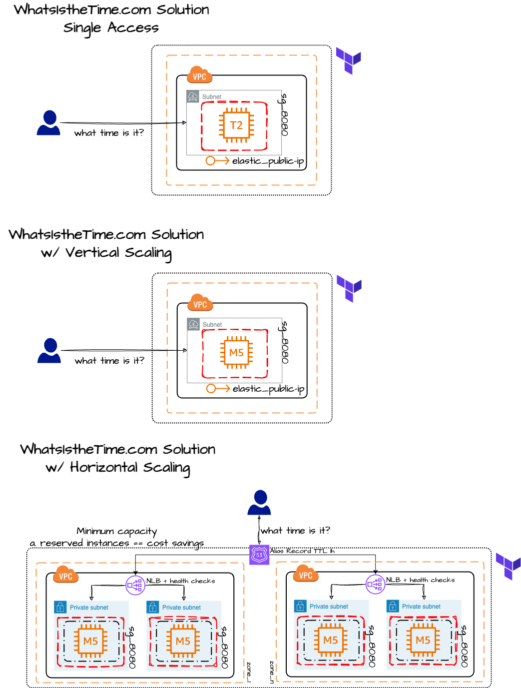

.MyClothes App
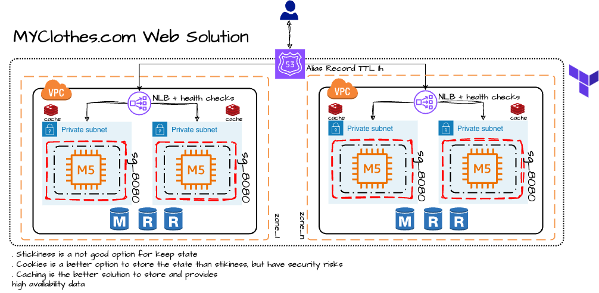

=== Serverless Architecture

****
. First Solution
* Expose as REST API with HTTPS
* Serverless Architecture
* Users should be able to directly interact with their own folder in S3
* Users should authenticate through a managed serverless service
* The users can write and read to-dos, but they mostly read them
* The database should scale and have some high-read throughput

.. Solution can be composed by AWS Gateway, (Cognito or RHSSO Keycloak En), Lambda and DynamoDB
.. IAM S3 Permission using Temp Credentials between Mobile Client and S3 Resources,
.. High-read throughput static data DAX for DynamoDb

.Mobile Serverless Api and Caching
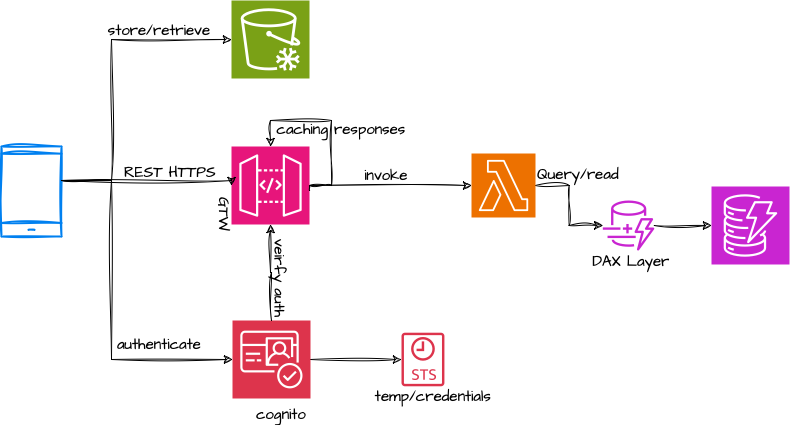

. Second Solution
** Site should scale globally
** Blogs are rarely written, but often read
** Some websites are purely static files, the rest is a dynamic REST API
** Caching must be implemented where possible
** New users that subscriber should receive a welcome email
** Any photo uploaded to the blog should have a thumbnail generated

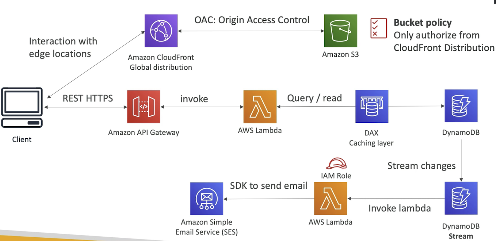

** To cloudfront ca use transfer acceleration whe uploaded a photo, and trigger a lambda to generate and the thumb and sns to email
****

=== Concepts

.AWS Timeline
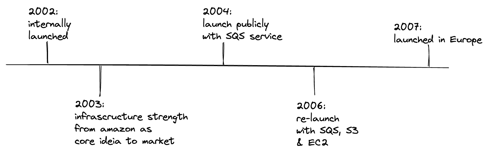

. AWS enables you to build sophisticated and scalable applications
. How to choose AWS Regions: its depends
.. Compliance with data governance and legal requirements: data never leaves a regions without your explicit permission
.. Proximity to reduce latency
.. Kinds of available services within a Region
.. Pricing all check price

. AWS Common Global Services

* Identity and Access Management (IAM)
* Route 53 (DNS Service)
* Cloud Front (Content Delivery Network)
* WAF (Web Application Firewall)

. AWS Services Common Region Services

* AWS EC2 (IaaS)
* Elastic Beans Talk (PaaS)
* Lambda (FaaS)

=== IAM & Fundamentals

* IAM (_Identity and Access Management_) is as global service, identities can be classified as humans and non-humans, it is  service get authenticated and authorized to acess resources

* Root account created by default, but never ever should be used or shared

* Users are people within an organization, and must be grouped; users can be federated

* The Principal concept can be assigned to a user, application that make a request for a _action_ or _operation_ on an AWS Resource

* Groups only contain users, not other groups, roles

* Always apply the [.underline]#*_least privilege principle_*#, that means, don't give more or any permissions that a user really needs

* Policies in a group will be applied in everyone inside this group

.IAM Policy Structure
[source,json]
----
{
  "Version": "2012-10-17",
  "Id": "S3-Account-Permission",
  "Statement": [
      {
        "Sid": "1",
        "Effect": "Allow",
        "Principal": {
          "AWS": ["arn:aws:iam::123456:root"]
        },
        "Action": [
          "s3:GetObject",
          "s3:PutObject"
        ],
        "Resource": ["arn:aws:s3:::mybucket/*"],
        "Condition": {
          "StringEquals": ""
        }
      }
  ]
}
----

* #Principal can be composed by of account/user/role#
* We can attach direct policies for a user, or even create an inline policy

.ARN User
[source,html]
----
arn:aws:iam:855174569821:user/dougdb
----

.IAMReadOnlyAccess Policy Sample
[source,json]
----
{
  "Version": "2012-10-17",
  "Statement": [
      {
        "Effect": "Allow",
        "Action": [
          "iam:GenerateCredentialReport",
          "iam:GenerateServiceLastAccessedDetails",
          "iam:Get*",
          "iam:List*",
          "iam:SimulateCustomPolicy",
          "iam:SimulatePrincipalPolicy"
        ],
        "Resource": "*"
      }
  ]
}
----

* Up to 5000 individual user accounts can be created

* We have Policies that are called Identity, based on policies and resources based policies

* Group can have one or Nth users, and the policy will define what this group can or not to do

* #IAM Roles for Services#, assign permissions to AWS Services with IAM Roles, e.g., some EC2 instance needs access Lambda

* Instance Profile: based on AWS STS (Security Token Service), e.g.: an EC2 instance needs access S3 bucket, for this to EC2 get authorized we never can store _Credentials or Secret Keys in instance_ the correct is use the instance profile and attach _IAM role_ to the instance, EC2 will th attempt to assume the role using STS Assume Role API Calls, by a specific policy called _Trust Policy_, composed by a _Permission Policy_ that classify which actions can be made in this bucket, the trust policy control can assume the role based on a STS temporary security credentials provided to EC2

.Instance Profile on Trust Policy STS
[source, json]
----
{
  "Effect": "Allow",
  "Principal": {
    "Service": "ec2.amazonaws.com"
  },
  "Action": "sts:AssumeRole "
}
----

==== Identity-based Policies vs Resource-based Policies

*Identity-based* policies are attached to an IAM user, group, or role. These policies let you specify what that identity can do (its permissions). For example, you can attach the policy to the IAM user named John, stating that he is allowed to perform the Amazon EC2 RunInstances action. The policy could further state that John is allowed to get items from an Amazon DynamoDB table named MyCompany.

*Resource-based* policies are attached to a resource. For example, you can attach resource-based policies to Amazon S3 buckets, Amazon SQS queues, VPC endpoints, and AWS Key Management Service encryption keys. For a list of services that support resource-based policies.

With resource-based policies, you can specify who has access to the resource and what actions they can perform on it. To learn whether principals in accounts outside your zone of trust (trusted organization or account) have access to assume your roles. Resource-based policies are inline only, not managed.

* See more details in https://docs.aws.amazon.com/IAM/latest/UserGuide/access_policies_identity-vs-resource.html[Identity-based policies and resource-based policies]

* Cross-account scenarios we have two scenarios, first, attach a resource-based policy to a resources (S3), or, secondly, use a role as proxy, 1. (User/AccountA -> User/AccountB (owner assuming role) -> access S3) | 2. (User/AccountA through a bucket policy access S3), the difference between these two situations is, when you assume a role (app, user or service) you give up your original permission and take the permissions assigned to the role, when we are using resource-based policy the principal doesn't have to give up his permission, e.g; (User/AccountA -> Dump DynamoDB -> dump -> Account/B S3), in this case we should use a resource based policy

* More details see https://docs.aws.amazon.com/IAM/latest/UserGuide/reference_policies_evaluation-logic.html#policy-eval-basics[Policy evaluation logic]

.Resource Policy for a Principal
[source,json]
----
{
  "Version": "2012-10-17",
  "Id": "Policy313323412",
  "Statement": [
      {
        "Sid": "Stmt313323412",
        "Effect": "Allow",
        "Principal": {
          "AWS": "arn:aws:iam::515148244:user/Paul"
        },
        "Action": [
          "s3:*"
        ],
        "Resource": "arn:aws:s3::theHellsBucket"
      }
  ]
}
----

* IAM Cross Account: when a different account needs to perform some actions in your account

* Permission Boundaries: sets the maximum available permissions an Identity can have, Privilege escalation must be avoided using permission boundaries

.Permission Boundaries
[source, json]
----
{
  "Version": "2012-10-17",
   "Statement": [
      {
        "Effect": "Allow",
        "Action": [
          "s3:*",
          "cloudwatch:*",
          "ec2:*"
        ],
        "Resource": "*"
      }
  ]
}
----

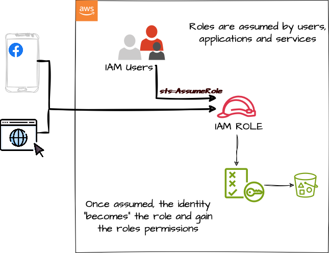

* IAM Roles are classified as:

** _AWS Users_: User can use _sts:AssumeRole_ to have some permissions through policies attached

** _AWS Services_: Allow AWS services like EC2, Lambda or other to perform actions in this account, most common use cases are EC2 and Lambda

** _AWS Account_: Allow entities in other AWS accounts belonging to you or 3rd party to perform actions in this account

** _Web Identity_: Allows users federated by the specified external web identity provider to assume this role to perform actions in this account

** _SAML 2.0 federation_: Allow users federated with SAML 2.0 from a corporate directory to perform actions in this account

** _Custom trust policy_: Create a custom trust policy to enable others to perform actions in this account

* #Quick summary for IAM#

- Users: mapped to a physical user, has a password for AWS Console

- Groups: contains only users

- Policies: JSON document that outlines permissions for users or groups

- Roles: for AWS EC2 instances or AWS Services, is a way to delegate permission to other services and potential users

- Security: MFA + Password Policy

- Grant Least Privilege

- IAM Credentials Report is a Security Tool

-  https://policysim.aws.amazon.com/[Policy Simulator]

==== IAM Advanced

* AWS Organizations is a global service that allows to manage multiple AWS accounts,
* The main account is the management account; the billing is consolidated across all accounts, single payment method
** Advantages: Cloudtrail on all accounts. send logs to central s3 accounts, cloudwatch logs to a central logging account, establish cross-account roles for Admin purposes
* SCP Service Control Police, with IAM policies applied to OU or Accounts to restrict Users and Roles
* #No SCP can be applied in the Management Account, it can do anything#

.SCP Blocklist and Allowlist Sample
[source, json]
----
{
  "Version": "2012-10-17",
  "Statement": [
    {
      "Sid": "AllowAllActions",
      "Effect": "Allow",
      "Action": "*",
      "Resource": "*"
    },
    {
      "Sid": "DenyDynamoDB",
      "Effect": "Deny",
      "Action": "dynamodb:*",
      "Resource": "*"
    }
  ]
}
----

=== EC2 Fundamentals

* Used in everywhere and means Elastic Compute Cloud, one of the most important services in AWS

.Instances EC2 Type
[%header,cols=4*]
|===

|Family
|Type
|vCPUs
|Memory GiB

|General purpose
|t2.micro
|1
|1

|Compute Optimized
|c5n.large
|2
|5.25

|Memory optimized
|r5ad.large
|2
|16

|Storage Optimized
|d2.xlarge
|4
|30.5

|GPU instances
|g2.xlarge
|8
|15

|===

****
* Benefits of EC2
. *Elastic Computing*: easily launch hundreds of thousands of EC2 instances within minutes.
. *Complete Control*: you control the EC2 instances with full root/administrative access.
. *Flexible*: Choice of instance types, operating systems, and software packages
. *Reliable*: EC2 offers very high levels of availability and instances can be rapidly commissioned and replaced
. *Secure*: Fully integrated with Amazon VPC and security features
. *Inexpensive*: Low cost, pay for what you use
****

* Composed by many definitions such as:

. Virtual Machines (EC2 Instances)

. Storing data (EBS & EFS)

. Distributing loads across machines (ELB)

. Scaling the instances using auto-scaling group (ASG)

. EC2 Instance types: https://aws.amazon.com/ec2/instance-types[Ec2 Instance Types], we can check specific instances vantages on https://instances.vantage.sh[Instances Vantages]

* Security Group plays a critical role over AWS network, they control how the traffic (firewall) is allowed into or out of our EC2 instance, sg (security groups) can be also referenced between them using inbound/outbound concepts

* Custom AMIs to optimize setups—https://blog.devops.dev/create-aws-ec2-instance-using-terraform-with-custom-ubuntu-amazon-machine-image-ami-having-f0b58c79864a

* #*_Never ever_*, run *_aws configure_* command, inside an EC2 instance *NEVER*, instead of use IAM Policies#; instead of use *Instance profile* is the way that we can connect an IAM Role to our EC2 instance

.Instances EC2 Type
[%header,cols=2*]
|===
|Instance Model
|Use Case

|On-Demand
|Developer working on a small project for several hours, cannot be interrupted

|Reserved
|Steady-state, business critical, line-of-business application; continuous demand

|Scheduled Reserved
|Reporting Application, run for 6 hours a day, 4 days per week

|Spot Instances
|Developer working on a small project for several hours; cannot be interrupted

|Dedicated Instances
|Security-sensitive application requires dedicated hardware, per-instance billing

|Dedicated Hosts
|Database with per-socket licensing
|===

=== Private vs Public Network (IPv4)

* Networking in AWS can define IPs over IPv4 and/or IPv6; IPv4 _1.160.10.240_ - IPv6 _3ff3:1900:4545:3:200:f8ff:fe21:67c7_

* In private Network, all the computers / servers can talk to one another using private IPs, after attaching IGW Internet Gateway, these server instances can talk with public internet

.IGW Public Communication
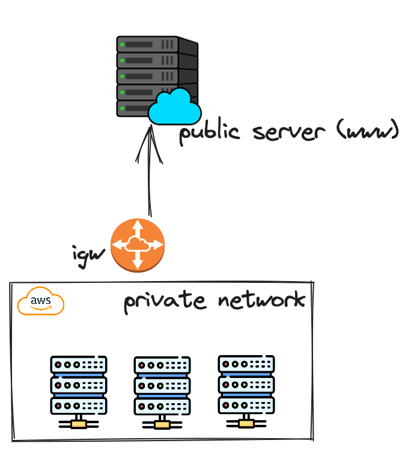

* Public IP must be unique across the whole internet

* Private IP can be identified and used only inside a private network

* EC2 has ephemeral ip, but we can use elastic ip to keep the same value

* In general *_don't use Elastic IPs_*

=== Placement Groups

* Control EC2 Instances (Same Rack, hardware, and Same AZ) using some different strategies such as _Cluster_, _Spread_ and _Partition._
* Cluster low-network latency but need willing to take the risk when the rack fails, all the instances will stop also
* Spread low fail risk over split instances among AZs, but have limitation to seven instances per AZ
* Partition instances in multiple instances but not all isolated

=== Elastic Network Interfaces (ENI)

* Logical components in a VPC that represents a virtual network card, eth0 attached in an EC2 instance, with one or secondary IPv4, mac address

* Which scenario we need a 2 ENIs with private IPS?
The same application spread out in different instances can be accessed/tied using two different ENIs but with different IPs, *but ENis cannot be attached across AZs*

* ENIs and EPIs can be _remapped_ to different instances

.Using ENI Concept Attach in
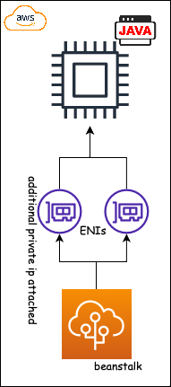

=== NAT Gateways and NAT Instances

* Both are used for the one purpose, that is to enable the instances that we deploy into private subnets to connect to the internet, based on outbound connecting

* Main rules are, NAT Gateways/Instance(EC2 Instance like bridge or proxy and must disable the source/destinations checks) will always be deployed in Public Subnets, never in private, and the NAT IPs must be bind in Route table

=== EC2 Instance Storage (EBS CSi)

* EBS (Elastic block storage) volume is a *network drive* you can attach to your instances; it allows us to persist the data even after the instance terminates they can be mounted just to one instance at a time, *_they are bound to a specific availability zone_*, that means it cannot be attached in different zones

* We can attach two different EBS Volumes attached at the same instance

* They are locked to an Availability Zone (AZ), e.g.; an _EBS_ volume in _us-east-1a_ cannot be attached to _us-east-1b_

* Snapshots make a backup (snapshot) of your EBS volume, not the necessary detached volume, but is recommended to do it, can copy snapshots across AZ or region

* EBS are network drives, but with limited performance, to improve this u can create an EC2 Instance Store, better I/O performance, can be good for buffer/cache/temp data, but instance store loses their storage if they're stopped by (ephemeral behavior)

* EBS Volumes types

** gp2/gp3 (SSD) General purpose volume
** iol/io2 (SSD) highest-performance SSD volume
** stl (HDD) low cost HDD volume
** scl (HDD) the lowest cost using HDD, used to be less frequently accessed

* EBS Multi-attach over iol/io2 family *is possible to attach the same EBS volume to multiple EC2 instances in the same AZ*

* EBS Encryption is possible to protect all the data stored even over snapshots, all the encryption is transparent and handled by EC2 and EBS, with minimal impact on latency

.EBS Volume TF sample
[source,hcl-terraform]
----
resource "aws_volume_attachment" "my_ec2" {
  count = var.instances_number

  device_name = "/dev/sdh"
  volume_id   = aws_ebs_volume.ebs.id
  instance_id = module.ec2.id
}

resource "aws_ebs_volume" "ebs" {
  count = var.instances_number

  availability_zone = module.ec2.availability_zone
  size              = 10 // GiB
}
----

* Instance metadata is alwyas available in http://169.254.169.254/latest/meta-data

=== Amazon EFS

* Managed NFS (network file system), then can be mounted on many EC2 over multi-az, and scaled up automatically
* EFS works with EC2 instances in multi-AZ, scalable but expensive (3x gp2 w/ pay per use), can be used to web serving, data sharing
* It uses NFSv4.1 protocol
* Use _Security Group_ to control access to EFS, only compatible with Linux OS, can be encrypted using KMS
* Can be classified as Standard for frequent access and infrequent (EFS-IA) const to retrieve files, lower price to store

* https://github.com/terraform-aws-modules/terraform-aws-efs/blob/v1.2.0/examples/complete/main.tf[TF EFS Creation Sample] using EFS over Terraform

=== High Availability and Scalability: ELB & ASG

* There are two kinds of scalability:
** Vertical and Horizontal scalability, #_on the vertical side we've a t2.medium scaled up to the u-l2tbl.metal machine_# this is hardware/physical improvement, #_on the horizontal side we're replicating the same instance multiple times_# using scale-out (increase instances) and scale-in (decrease instances)

==== Load balancers

* Servers just to forward the traffic to multiple target servers, e.g.; _EC2 instances_, to spread loads across multiple instances with single point of access (DNS), with regular health checks, handling HTTP/s connections

* AWS provide _4 kinds ALB models_
. Classic Load Balancer - [CLB] HTTP/s, TCP, SSL
. Application Load Balancer - [ALB] HTTP/s, WebSocket
. Network Load Balancer - [NLB] TCP, TLS, UDP
. Gateway Load Balancer [GWLB] Operates at Layer IP Protocol

* Load balancers use security groups to allow traffic to control ports and protocol rules, #_an enhancement security action can be considered to use SG HTTP 80 a tied communication with ALB target_#

* SSL over Load Balancer, HTTPs Over www/ALB/HTTP over private VPC under X.509 certificate

* Deregistration delay - ALB & NLB, time to complete _in-flight requests_ while the instance is unregistering or unhelthy

* ALB operates at the request level, routes based on content of request #(layer 7)#,
supports routing based on path, host, source-ip address and query-string,
supports EC2 Instances, IP Addresses, lambda function and containers as targets

* NLB operates at the connection level, routes connections based on IP protocol data #(layer 4)#, offers ultra-high performance, low latency and TLS offloading at scale, support static IP/Elastic IP, supports UDP and static IP addresses as targets

* GLB Used in front of virtual appliances such as firewall, IDS/IPS and deep packet inspection system, uses Layer 3 listening all packets on all ports

[%header,cols=3*]
|===
|Feature
|ALB
|NLB

|OSI Layer
|7
|4

|Target Type
|HTTP, HTTPS, gRPC
|TCP,UDP,TLS

|Private Link
|No
|(TCP,TLS)

|Static IP address
|No
|Yes

|HTTP Header-Based Router
|Yes
|No

|Source IP preservation
|x-forwarded-for
|native

|SSL Termination
|Load Balancer
|Load Balancer on target

|===

.Application Load Balancer Layer 7 sample, more details https://github.com/DouglasGo8/terraform-onreal-aws/blob/main/iac-aws/sre-ec2/alb[ALB TF]
[source,hcl-terraform]
----
# Routing support query-string/hostname/path/headers
module "application-alb" {
  source             = "terraform-aws-modules/alb/aws"
  version            = "8.7.0"
  name               = "${local.name}-application-elb-http"
  #
  load_balancer_type = "application"
  vpc_id             = "data.vpc_id"
  subnets            = ["var.subnet_1.xxx", "var.subnet_2.yyy"]
  security_groups    = [module.application_alb_http_sg.security_group_id] # bastion host
  # Listeners
  http_tcp_listeners = [
    {
      port               = 80
      protocol           = "HTTP"
      target_group_index = 0 # TG Index = 0
    }
  ]
  # Target Groups
  target_groups = [
    # App1 Target Group - TG Index = 0
    {
      name_prefix          = "app1-"
      backend_protocol     = "HTTP"
      backend_port         = 80
      target_type          = "instance"
      deregistration_delay = 10
      health_check         = {
        enabled             = true
        interval            = 30
        path                = "/app1/index.html"
        port                = "traffic-port"
        healthy_threshold   = 3
        unhealthy_threshold = 3
        timeout             = 6
        protocol            = "HTTP"
        matcher             = "200-399"
      }
      protocol_version = "HTTP1"
      # App1 Target Group - Targets
      targets          = {
        my_app1_vm1 = {
          target_id = "ec2_private.id[0]"
          port      = 80
        },
        my_app1_vm2 = {
          target_id = "ec2_private.id[1]"
          port      = 8080
        }
      }
      tags = local.common_tags # Target Group Tags
    }
  ]

  # HTTPS Listener Rules
  https_listener_rules = [
    # Rule-1: /app1* should go to App1 EC2 Instances
    {
      https_listener_index = 0
      actions = [
        {
          type               = "forward"
          target_group_index = 0 # TARGET Group
        }
      ]
      conditions = [{
        path_patterns = ["/app1*"]
      }]
    },
    # Rule-2: /app2* should go to App2 EC2 Instances
    {
      https_listener_index = 0
      actions = [
        {
          type               = "forward"
          target_group_index = 1
        }
      ]
      conditions = [{
        path_patterns = ["/app2*"]
      }]
    },
  ]

  tags = local.common_tags
}
----

.Network Load Balancer Layer 4 Sample to handler tons of a million requests per second
[source,hcl-terraform]
----
# Less latency  +/- 100ms NLB vs +/- 400ms for ALB
# Must be private IPs over EC2 instances
# It is possible a combination of NLB and ALB handle http traffic
module "nlb-alb-microservice-quarkus.io-app" {
  source              = "terraform-aws-modules/alb/aws"
  #
  version             = "8.7.0"
  name_prefix         = "microservice-nlb.quarkus.io-app"
  load_balancer_type  = "network"
  vpc_id              = module.vpc.vpc_id # data.vpc.id
  subnets             = module.vpc.public_subnets # data.subnets.public_id[0, 1]

  #  TCP Listener
  http_tcp_listeners = [
    {
      port               = 80
      protocol           = "TCP"
      target_group_index = 0
    }
  ]

  #  TLS Listener
  https_listeners = [
    {
      port               = 443
      protocol           = "TLS"
      certificate_arn    = module.acm.acm_certificate_arn
      target_group_index = 0
    },
  ]

  # Target Groups
  target_groups = [
    {
      name_prefix          = "microservice-quarkus.io-app"
      backend_protocol     = "TCP"
      backend_port         = 80
      target_type          = "instance"
      deregistration_delay = 10
      health_check = {
        enabled             = true
        interval            = 30
        path                = "/health"
        port                = "traffic-port"
        healthy_threshold   = 3
        unhealthy_threshold = 3
        timeout             = 6
      }
    },
  ]
  tags = local.common_tags
}
----

* GWLB will not be covered in this doc
* Sticky session is a feat., that means the same client is always redirected to the same instance
* Cross-zone is enabled by default only ALB model, no charges for inter AZ data, NLB and GWLB are disabled by default, with charges per AZ

==== Autoscaling Group

* Supports auto instance scaling, based on events and load increase
* There is a combination between ALBs and ASG over Scale-in and out.
* Use launch-template (launch-configuration are deprecated)
* Auto-scaling (in/out) can be based on CloudWatch alarms, ttps, avg. Of cpu
* Responds to EC2 status checks and Cloudwatch metrics
* Can scale based on demand (performance) or on a schedule

.Launch Template Options
****
AMI and Instance type

EBS Volume

Security Groups

Key pair

IAM instance profile

User data

Shutdown behavior

Termination protection

Placement group name

Capacity reservation

Tenancy

Purchasing option (e.g. Spot)

****

.Launch Config Options
****
ANU and Instance type

EBS Volume

Security Groups

Key pair

Purchasing option (e.g Spot)

IAM Instance profile

User data
****

==== RDS & ElastiCache

* It Can increase up to 15 Read Replicas within AZ, Cross AZ or Cross Region
* Replication is _ASYNC_, so reads are eventually consistent without additional costs in the same Region
* Migrations from Single-AZ to Multi-AZ have downtime ops (no need to stop the DB)
* Aurora is a proprietary tech from AWS (not open-sourced), have auto-scaling feature
* With different EC2 machines, we can have custom endpoints to run analytical queries
* An important feature is RDS Proxy that works for RDS apps to pool and share DB connections established with the database; this improves database efficiency by reducing the stress on database resources  _https://github.com/terraform-aws-modules/terraform-aws-rds-proxy[RDS Proxy TF detail]_, never can be accessible outside a VPC
* ElastiCache is a managed cache cluster for Redis or Memcached

==== Route 53

* DNS (domain name system) basically can be classified as friendly hostname into the machine _IP_address;_ e.g.; _"google.com => 172.217.18.36"_, dns is the backbone of the Internet
* Domain Registrar: Amazon Route 53, GoDaddy etc, can be classified in Records A, AAAA, CNAME, NS etc. stored in zone files, classified also as top level domain such as, .com, .us, .in, .gov etc, secondary level such as amazon.com, https://www.redhat.com/en as bellow demonstrated

.URL Definition
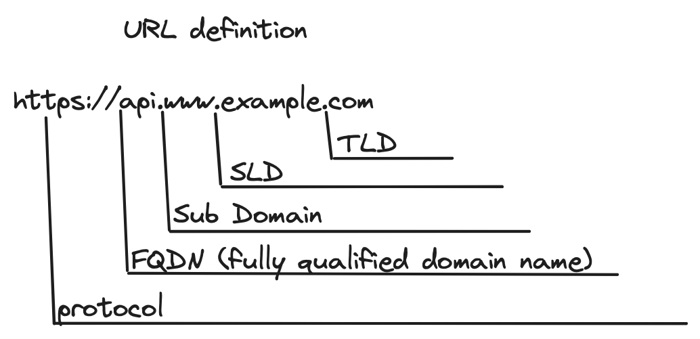

.DNS Internal Works _(TTL CACHE)_
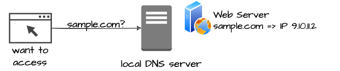

* Root DNS server will be asked for the address in Managed ICANN (.com) after Managed IANA (TLD) and after ask to DNS Server (SLD) resulting in a record 'A' with a specific IP address

* Route 53 is available, scalable, fully managed and _authoritative DNS_ this means the customer can update the DNS records, Route 53 is also a _domain registrar_ with the ability to check the health of your resources

.Route 53 internals
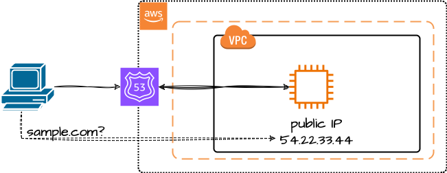

* Each record contains:
** Domain/subdomain,
** Record Type A or AAAA
** Value of record 12.33.21.22
** Routing Policy, how route response to queries
** TTL amount of time the record cached at DNS Resolvers
** Records type as A / AAAA / CNAME and NS or Advanced as CAA / DS / MX / NAPTR / PTR / SOA / TXT / SPF and SRV

* Records Types classification
. A maps a hostname to IPv4
. AAAA maps a hostname to IPv6
. CNAME maps a hostname to another hostname, but the target must have an A or AAAA record, can't create a _CNAME_ record for the top node of DNS, not for example.com but yes to www.example.com
. Public Hosted Zones contain records that specify how to route traffic to the internet, e.g., _application1.mypublicdomain.com_
. Private Hosted Zones same public but the traffic will not be exposed, only works within a VPC e.g., _application1.mypublicdomain.com_
. All DNS registrations will cost $0.50 monthly per hosted zone

.Route53 Public vs Private Zones
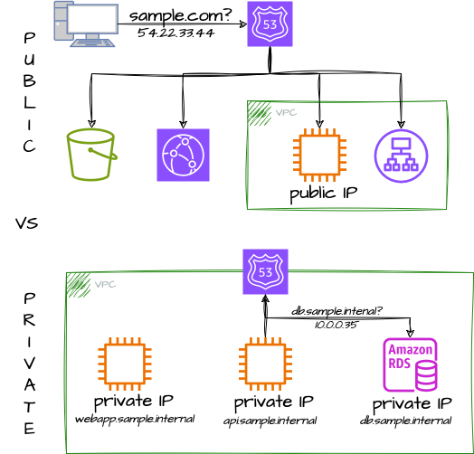

.Route53 Record
[source,hcl-terraform]
----
resource "aws_route53_record" "www" {
  zone_id = aws_route53_zone.primary.zone_id
  name    = "www.sample.com"
  type    = "A"
  ttl     = 300
  records = [aws_eip.lb.public_ip]
}
----

* CNAME vs Alias to aws resources (ALB, Cloud front) exposes an AWS hostname, cname allows us to point to a hostname, but only for *NON-ROOT DOMAIN*, for alias options we can point to a hostname to an aws resource, works for both root and non-root domain and automatically recognizes changes in the resource's IP addresses

* Route53 queries is not the same as ALB routing the traffic, DNS doesn't rout any traffic, it only responds to the DNS queries, if multiple values were specified in the same record, a random address will be chose

=== Decoupling Apps with Messaging

==== SQS

* Uses Queue as core messaging, based on pooling consumer in fulled managed service used to decoupling applications with unlimited throughput and messages in queue, with 4 days retained a message with 14 as maximum, low latency is one of superb features with 10ms to produce and receive the message but with a 256KB limitation payload

* SDK to send Message API, the message is persisted until a consumer (gets / deletes) it, consumers receive and process messages in parallel, with _at-least-once_ delivery semantic, consumes will delete the message after consumes it

* ASG scaling instance based on Queue length (Similar Keda) using _approximateNumberOfMessages_ as cloud metric alarm

* When a message is polled (consumed) by a consumer, it becomes invisible to other consumers by default, a message will remain invisible by 30 seconds, if it isn't processed inside the default range, it will be processed twice, the feat _changemessagevisibility_ can be changed to get more time to process a message

* Long polling, is when the consumer can wait for a message to arrive at your destination, _long polling_ decreases the number of API calls made to SQS while increasing the efficiency and latency in your application, in _

.Apache Camel use case
....
waitTimeSeconds (consumer): Duration in seconds (0 to 20) that the ReceiveMessage action call will wait until a message is in the queue to include in the response.
....

* SQS FIFO (first-in first-out) messages will be ordered in a queue, this feat has some limitations for 300 msg/s and no batching

* SQS as a buffer to database writes is common pattern to no loose transactions

==== SNS

* SNS works like broadcast to message, when a lot of consumer needs of the same message for different purposes

* SNS + SQS Fanout pattern is SQS as Subscriber to an SNS Topic, as a possible sample we have a S3 bucket send an event for multiple SQS, here we can use the _SNS Fanout pattern_

* SNS can filter a message based on JSOn Policies

==== Kinesis

* Responsible for _collect, process and analyze_ streaming data in real-time, suc logs, metrics website and clickstreams IoT telemetry data...

* Shards is like Kafka partitions

==== Amazon MQ

* Traditional apps are running from on-premises may use open protocols such as MQTT, AMQP, STOMP etc. it does scale at the same proposition as SNS,SQS, and the MQ high availability will be crafted by multi zone

=== Containers on ECS Fargate ECR and EKS

* Docker is software to run apps; Docker images are stored in Docker Repositories

* On AWS we've three containers management they are ECS, EKS and Fargate

* ECS Load Balancer Integrations refer to ALB support to some use cases, NLB is recommended only for high throughput/high performance use cases, or to pair it with AWS Private link

* Tasks running in any AZ will share the same data in the EFS file system

* ECS Automatically increase/decrease the desired number of ECS tasks, using AWS App Auto Scaling ECS Service Average CPU Utilization or Average Mem Utilization or Request Count Per Target, can be also scaled based on Target Tracking, Step Scaling or Schedule Scaling

- https://docs.aws.amazon.com/AmazonECS/latest/developerguide/scheduling_tasks.html[ECS Tasks Schedule and Manual]

****
.ECS Task invoked by EventBridge
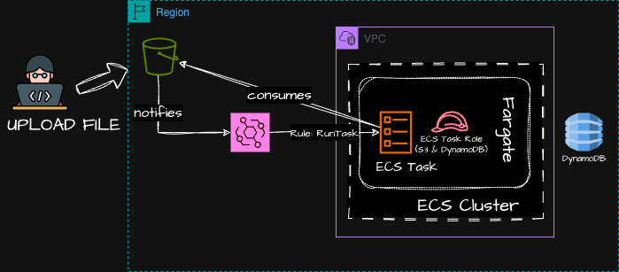

* This solution must be updated to include SQS, Lambda, DynamoDb and everything orchestrated by Apache Camel on Quarkus Bootstrap
****

* ECS Tasks exited can notify Event Bridge and send information about some possible issue

* EKS Data Volumes supports, EBS, EFS FSx and FSx for NetApp ONTAP

* AppRunner is a fully managed service that makes it easy to deploy web apps and apis at scale, no infrastructure required, started by source code or container

=== Serverless

* A new paradigm in which the developers don't have to manage servers anymore
* Initially... Serverless == FaaS (Function as a Service)

.AWS Serverless
[%header,cols=1*]
|===

|AWS Serverless List
|Lambda
|DynamoDb
|Cognito
|API Gateway
|S3
|SNS & SQS
|Kinesis
|Aurora Serverless
|Step Functions
|Fargate
|===

* Virtual Functions without server management
* Limited by time—short executions
* Run on-demand
* Scaling is automated

==== Lambda Limits - per Region

* Memory allocation 128MB up to 10GB (1MB increments)
* Maximum execution time 900 seconds (15Min)
* Env Variables up to 4KB
* Disk capacity in the "function container" (in /tmp) 512 to 10GB
* Concurrency executions: 1000 p/s (can be increased)

.CloudFront Functions vs Lambda@Edge - Use Cases
[%header,cols=2*]
|===
|CloudFront Functions
|Lambda@Edge

|Cache Key normalization: Transform request attributes (headers, cookies, query string, URL) to create an optimal Cache Key
|Longer Execution time (several ms)

|Header manipulation: Inserts/modify/delete HTTP headers in the request or response
|Adjustable CPU or memory

|URL rewrites or redirects
|Your code depends on a 3rd libraries (eg; AWS SDK to access other AWS Services)

|Request Authentication & Authorization: Create and validate user-generated tokens (e.g., JWT) to allow/deny requests
|Network access to use external services for processing
|N/A
|File System access or access to the body HTTP Headers
|===

* Lambda can be invoked from RDS & Aurora, that allow process data events from within a database
* Supported by RDS for PostgreSQL and Aurora MYSQL (Debezium Concept)

=== DynamoDb Notes

* DynamoDB Accelerator (DAX) is a fully managed, highly available, in-memory cache for DynamoDB that delivers up to 10x performance improvement. It caches the most frequently used data, thus offloading the heavy reads on hot keys off your DynamoDB table, hence preventing the #"ProvisionedThroughputExceededException"# exception.

* DynamoDB Streams allows you to capture a time-ordered sequence of item-level modifications in a DynamoDB table. It's integrated with AWS Lambda so that you create triggers that automatically respond to events in real-time.

=== Database AWS Solutions

* RDBMS (SQL/OLTP); RDS, Aurora, great for Joins
.. Auto-scaling capability for storage
.. Security through IAM, Security Groups, KMS and SSL in transit
.. Aurora Serverless, for unpredictable/intermittent workloads

* NoSQL database; no joins, noSQL DynamoDB (Json), ElasticCache, Neptune, DocumentDb 4MongoDB, Keyspaces
.. ElastiCache In-memory data-store, sub-millisecond latency
.. DynamoDB is a proprietary db serverless NoSQL
.. Keyspaces is a Cassandra Managed Equivalent DB

* Data Warehouse (SQL Analytics) Redshift OLAP, Athena, EMR

* Search: Opensearch (JSON) free text, unstructured searchs

* Graphs Amazon Neptune; display relationships between data

* Ledger; Amazon Quantum Ledger Database

* Time series Amazon Timestream

=== Data & Analytics

* AWS Athena is a serverless service to analyze data stored in AWS S3, using standard SQL language to query the files build on Presto, use cases can be BI, analytics, reporting and analyze & query VPC Flow Logs, ELB Logs
* In AWS Athena we can use COLUMNAR data for cost-savings (less scan), using file > 128 to reduce overhead

* AWS Redshift is based on Postgres, but it's not used for OLTP, but OLAP online analytical processing (analytics and warehousing), with 10x better performance that other data warehouses

* AWS Glue is an ETL managed Service useful to prepare and transform data for analytics

=== Monitoring & Audit with CloudWatch and CloudTrail

* Cloudwatch provides metrics for *EVERY* service in AWS

* Can create CloudWatch dashboards of metrics and Cloudwatch Custom Metrics (RAM metrics)

* Cloudwatch metrics Streams near real-time delivery and low latency with Kinesis Data Firehouse and the its destinations

* Cloudwatch logs are classified in groups (arbitrary name, usually representing an app) or stream (representing instances within app / log files / containers), we can define log expiration policies

* Cloudwatch can aggregate data from different regions/accounts based on subscription filter combining kinesis data stream with kinesis firehouse and a destination, always near real time

* By default, no logs from EC2 machine go to Cloudwatch; we need to enable Cloudwatch agent on EC2, to push log files you want

=== AWS Organization

* Allows consolidating multiple AWS accounts into an organization, includes root accounts and organizations units
* Police are applied to tp root accounts or OUs

* Consolidated accounts contain, paying accounts (independent and cannot resources of other accounts) / linked accounts - all linked accounts are independent

=== #*!!! Virtual Private Cloud (VPC) !!!*#

* What is a region? A physical location in the world and is independent of other regions, in a region we can have one or more Zones that is one or more data centers, that means that you've lots of redundancy within a region

* Every region is *Connected* via a high bandwidth with a fully redundant network, and we can deploy your applications across

.Amazon VPC Components
[%header,cols=2*]
|===
|VPC Component
|What it is

|Virtual Private Cloud (VPC)
|A logically isolated virtual network in the AWS cloud

|Subnet
|A segment of a VPC's IP address range where u can *place groups of isolated resources*

|Internet Gateway/Egress only Internet Gateway
|The amazon VPC side of a connection of the public internet IPv4/IPv6

|Router
|Routers interconnect subnets and direct the traffic between internet gateways, virtual private gateways, NAT gateways and subnets

|Peering Connection
|Direct connection between two VPCs

|VPC Endpoint
|Private Connection to public AWS Services

|NAT Instance
|Enables internet access for EC2 instances in private subnets managed by u

|NAT Gateway
|Enables internet access for EC2 instances in private subnets managed by AWS

|Virtual Private Gateway
|The amazon VPC side of VPN connection

|Customer Gateway
|Customer side of a VPN Connection

|AWS Direct Connect
|High speed, high bandwidth, private network connection from customer to aws

|Security Group
|Instance-level firewall

|Network ACL
|Subnet-level firewall

|===

.Security Groups Rules
[%header,cols=4*]
|===
|Type
|Protocol
|Port range
|Source

|SSH
|TCP
|22
|0.0.0.0/0

|RDP
|TCP
|3389
|0.0.0.0/0

|RDP
|TCP
|3389
|::/0

|HTTPS
|TCP
|443
|0.0.0.0/0

|HTTPS
|TCP
|443
|::/0

|All ICMP - IPv4
|ICMP
|All
|0.0.0.0/0
|===

.Network Inbound/Outbound Rules
[%header,cols=4*]
|===
|Rule
|Type
|Protocol
|Port Range
|Source
|Allow/Deny

|100
|All Traffic
|ALL
|ALL
|0.0.0.0/0
|ALLOW

|101
|All Traffic
|ALL
|ALL
|::/0
|ALLOW

|*
|All Traffic
|ALL
|ALL
|::/0
|DENY

|*
|All Traffic
|ALL
|ALL
|0.0.0.0/0
|DENY

|===

.VPC Architecture Definitions
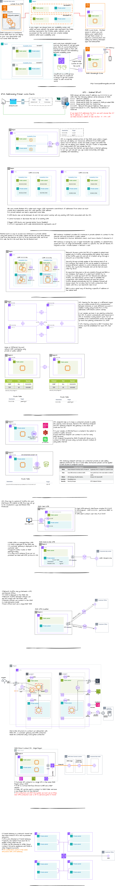

* VPC Flow Logs is a capture of information about IP traffic going to and from network interface in a VPC, all flow logs are stored using Cloudwatch Logs or S3, we can create using the levels.

.. VPC
.. Subnet
.. Network Interfaces

=== Amazon Simple Storage Service (S3)

.AWS Simple Storage Service
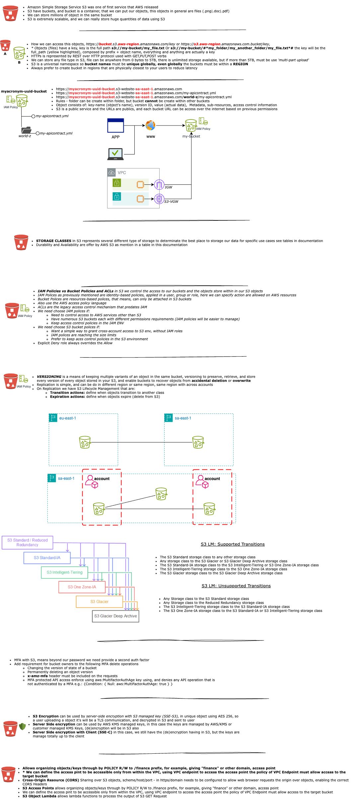

.S3 Storage Classes Durability and Availability
[%header,cols=2*]
|===
|Durability Protection against
|Availability is measurement

|Data loss
|The amount of time the data is available to you, e.g.: 99.99%

|Data corruption
|Express as a percentage of time per year

|S3 offers 11 9s durability (99.999999999), it means if you store 10 million objects, then you expect to lose one object every 10,000 years!
|

|===

.S3 Storage Classes
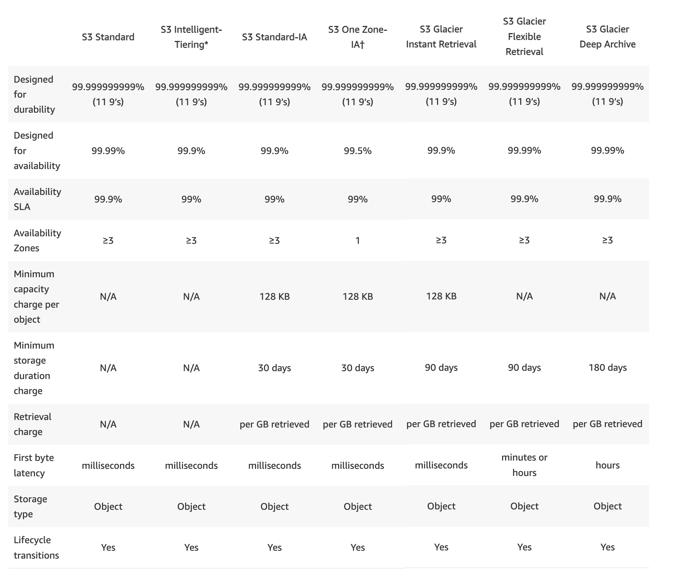

.S3 Bucket policy document sample
[source, json]
----
{
  "Version": "2012-10-17",
  "Id": "Policy1561964",
  "Statement": [
    {
      "Sid": "Stmt123342232",
      "Effect": "Allow",
      "Principal": {
        "AWS": "arn:aws:iam::551112134123:user/Paul"
      },
      "Action": "s3:*",
      "Resource": "arn:aws:s3:::mybucket"
    }
  ]
}
----

.Sample use S3 API using AWS CLI
[source,bash]
----
aws s3api list-buckets
----

.S3 TF Creation Sample
[source,hcl-terraform]
----

resource "aws_s3_object" "my_bucket" {
    bucket = "myUniqueGlobalName-bucket"
    acl    = false # fine grain security rules
    tags = {
      Name = "Bucket Tag"
      Environment = "Dev"
    }
}

# Json Polices 4Public access
resource "aws_s3_bucket_policy" "my_bucket_policy" {
  bucket = aws_s3_bucket.my_bucket.id

  policy = <<POLICY
{
  "Version": "2012-10-17",
  "Id": "my_bucket",
  "Statement": [
    {
      "Sid": "PublicRead",
      "Effect": "Allow",
      "Principal": "*",
      "Action": [
        "s3:GetObject"
      ],
      "Resource": "arn:aws:s3:::my_bucket/*",
    }
  ]
}
POLICY
}
----

.S3 Object Lambda and Apache Camel Solution
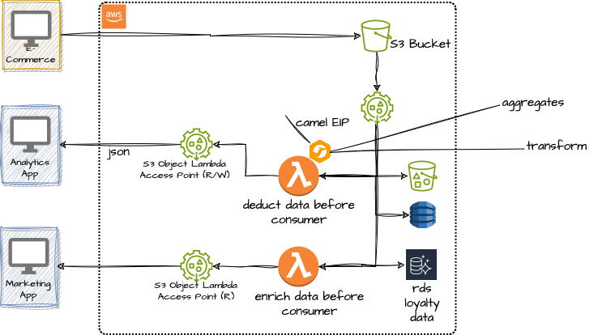

=== AWS Security

* Encryption/Decryption in flight (TLS/SSL), ensures no MITM (man on the middle) can stolen the data
* Server-side encryption at rest, means data is encrypted after being received by the server,
** Data is decrypted before being sent, and stored in a encrypted form thanks to a key
** The encryption/decryption keys must be managed for somewhere
* Client-side encryption, means that the data is encrypted by the client and never decrypted by the server
** Data will be decrypted by a receiving client
** The server should not be able to decrypt the data

==== AWS KMS

* Encryption in AWS means, in most part of the time, KMS
* AWS will manages the encryption keys for us, and is fully integrated with IAM for auth
* KMS provides two types of keys, Symmetric AES-256 keys, means single encryption key that is used to encrypt and decrypt
** Any service that are integrated with KMS use Symmetric CMKs
* The second key is Asymmetric (RSA & ECC key pairs),
** Public (Encrypt) and Private Key (decrypt)
** Can download the public key, but *never* the private key
* Types of Keys
** AWS Owned keys (SSE-S3, SSE-SQS,SSE-DDB) (default-key)
** AWS Managed key (aws/service-name e.g: aws/ebs)

.KMS encrypt/decrypt usage sample
[source, bash]
----
aws kms encrypt --key-id alias/foo --plaintext fileb://secret.dat --output text --query ChiphertextBlob --region- sa-east-1 > encrypted_secretFile.base64

cat  encrypted_secretFile.base64 | base64 decode > encrypted_secretFile

aws kms decrypt --key-id --ciphertext-blob fileb://encrypted_secretFile --output text --query Plaintext > decrypted_secretFile.base64 --region sa-east-1
----

* SSM Parameter Store to secure storage configuration and secrets, optional Seamless encryption using KMS, serverless scalable durable and easy SDK