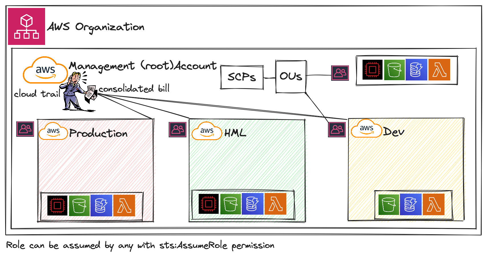

= Professional Certification

=== Links

- https://www.site24x7.com/tools/ipv4-subnetcalculator.html[Subnet Calculator for IPV4]
- https://www.calculator.net/ip-subnet-calculator.html[IP Subnet Calculator]

'''

* AWS Organization

. SCPs or *_Service control policy_* is a type of control policy that you can use to centrally control the maximum available *permissions granularity* for all accounts over an organization unit (OU)

.AWS Organization Structure overview

.SCPs Maximum Available Permission
[source,json]
----
{
  "Version": "2012-10-17",
  "Statement": [
      {
        "Effect": "Allow",
        "Action": "*",
        "Resource": "*"
      }
  ]
}
----

.SCP PowerUserAccess
[source,json]
----
{
  "Version": "2012-10-17",
  "Statement": [
    {
      "Effect": "Allow",
      "NotAction": [
        "iam:*",
        "organizations:*",
        "account:*"
      ],
      "Resource": "*"
    },
    {
      "Effect": "Allow",
      "Action": [
        "iam:CreateServiceLinkedRole",
        "iam:DeleteServiceLinkedRole",
        "iam:ListRoles",
        "organizations:DescribeOrganization",
        "account:ListRegions"
      ],
      "Resource": "*"
    }
  ]
}
----

.IAM Policy Sample
[source,json]
----
{
  "Version": "2012-10-17",
  "Statement": [
    {
      "Effect": "Allow",
      "Action": ["ec2:TerminationInstances"],
      "Resource": ["*"]
    },
    {
      "Effect": "Deny",
      "Action": ["ec2:TerminationInstances"],
      "Condition": {
        "NotIpAddress": {
          "aws:SourceIp": [
            "192.0.2.0./24",
            "203.0.113.0/24"
          ]
        }
      },
      "Resource": "*"
    }
  ]
}
----

. *_Tag Policy_* applied to enforce tag standardization, over other accounts e.g; HML Account

.SCPs Hierarchy Representation
[source,html]
----
|- root
|-|- [ou1]
|-|-|- dev-account
|-|-|-|- [ou2]
|-|-|-|-|- prod-account
----

* _FullAWSAccess_ SCP by default allows everything, SCPs list must be created to deny

.Enabling Service Control policy Over Organization
[source,json]
----
{
  "Version": "2012-10-17",
  "Statement": [
      {
        "Sid": "RequirementInstanceType",
        "Effect": "Deny",
        "Action": "ec2:RunInstances",
        "Resource": "arn:aws:ec2:*:*:instance/*",
        "Condition": {
          "StringNotEquals": {
            "ec2:InstanceType": "t2.micro"
          }
        }
      }
  ]
}
----

* After creating this policy, it must be attached over OUs tree; in this case using our tree, ou2 will inherit the same SCP, *_over your tree scenario neither DEV-OU1 nor PROD-OU2 can create ec2:instances different from t2:micro_*

.SCP EC2 Instance Launch Error
image::../thumbs/images/scp_ec2_launch_instance_error.png[]

- https://github.com/aws-samples/aws-scps-with-terraform[SCPs with Terraform GitHub Sample]

* Control Tower stays on the top of the organization and provides you some additional control, it integrates with a Directory Source over Single Sign On with SAML 2.0 or Microsoft AD, detective guardrails are used to governance and compliance

=== Identity & Federation

==== IAM

* Over EC2 instance roles: use the _EC2 metadata_ service.
One role at a time per instance

* Role is a short-term credentials, uses STS
* Policies AWS Managed, Customer Managed or Inline
* Resources Based Policies (S3 Bucket, etc..)

[source,json]
----
{
  "Version": "2012-10-17",
  "Statement": [
    {
      "Effect": "Allow",
      "Action": [
        "ec2:AttachVolume",
        "ec2:DetachVolume"
      ],
      "Resource": "arn:aws:ec2:*:*:instance/*",
      "Condition": {
        "StringEquals": {
          "ec2:ResourceTag/Department": "Development"
        }
      }
    },
    {
      "Effect": "Allow",
      "Action": [
        "ec2:AttachVolume",
        "ec2:DetachVolume"
      ],
      "Resource": "arn:aws:ec2:*:*:volume/*",
      "Condition": {
        "StringEquals": {
          "ec2:ResourceTag/VolumeUser": "${aws:username}"
        }
      }
    }
  ]
}
----

.Conditions Structure Schema
[source,json]
----
{
  "Conditions": {"{condition-operator}":  {
    "{condition-key}": "{condition-value}"
  }}
}
----

.Conditions Operators
[source,html]
----
String (StringEquals, StringNotEquals, StringLike,...)
 * Condition: { "StringLike": {"s3:prefix": ["", "home/", "home/${aws:username}/"]}}
Numeric (NumericEquals, NumericNotEquals, NumericLessThan,...)
Date..
Bool
(Not)IpAddress
 * Condition: {"IpAddress": {"aws:SourceIp": "203.0.113.0/24}}
ArnEquals:
Null:
----

* Best Practice: use the _least privileges_ pattern for maximized security
** Access Advisor: see permissions granted and when last accessed
** Access Analyser: Analyze resources that are shared with external entity

.IAM Roles vs Resources Based Policies
image::../thumbs/images/IAM_Roles_vs_ResourceBasedPolicies.png[]

. Using assume role (user, application or Service), you give up your original permission and take the permissions assigned to the role
. Using resource-based policy, the principal doesn't have to give up any permissions

. Example: User in _Account A_ needs to _scan_ a DynamoDB table in _Account A_ and _dump_ it in a S3 bucket in _Account B_

.. IAM ROLE in account A to allow scan action, after we need also a resource policy on the S3 bucket on account B

==== IAM Analyzer

. Find out which resources are shared externally, delimited by Zone of trust (AWS Boundary)

. Cloudtrail logs are reviewed to generate the policy with the fine-grained permissions and the appropriate Actions and Services

.IAM Analyzer with Policy Generation
image::../thumbs/images/IAM_Analyzer_actions.png[]

=== Identity Management and Permissions

* Here we do through the IAM service and all principals must be authenticated, what is a principal, a _person_ or _application_ that can make a request for an action or operation on AWS Resource
* The identity-based policy applies to users and roles; they are JSON permissions policy documents that control what actions an identity can perform
* The resource-based policy applies to AWS resources, are JSON documents also

.The Resource-based policy for user Paul
[source,json]
----
{
  "Version": "2012-10-17",
  "Id": "Policy123456",
  "Statement": [
    {
      "Sid": "Stmt123455600",
      "Effect": "Allow",
      "Principal": {
        "AWS": "arn:aws:iam::515123311123:user/Paul"
      },
      "Action": "s3:*",
      "Resource": "arn:aws:s3:::theBucketXXX"
    }
  ]
}
----

==== Users, Groups, Roles and Policies

* Inside an AWS Account we've all of this, _users_, _groups_, _roles_ and _policy_
* Users gain the *permissions* applied to the group through the policy; with policies we can define _permissions_ for the identities or resources they are associated
* Up to 5000 individual user accounts can be created, users have no permissions by default.
* The main reason to use groups is to apply _permissions_ to users using _policies_;
* Roles are assumed by users, applications and services

==== AWS Security Token STS

.AWS Security Token Service (STS)
image::../thumbs/images/aws-security-token-service.png[]

===== RBAC and ABAC

* Role-Based Access and Attribute-Based Access Controls, the good method is apply the minimum permissions a user needs, and can be classified such as _Administrator_, _Billing_, _Data Scientist_

.ABAC Policy Sample with Tag Key and Tag Value
[source,json]
----
{
  "Version": "2012-10-17",
  "Statement": [
    {
      "Effect": "Allow",
      "Action": [
        "rds:DescribeDBInstances",
        "rds:DescribeDBInstances",
        "rds:DescribeGlobalClusters"
      ],
      "Resource": [
        "*"
      ]
    },
    {
      "Effect": "Allow",
      "Action": [
        "rds:RebootDBInstance",
        "rds:StartDBInstance",
        "rds:StopDBInstance"
      ],
      "Resource": "*",
      "Condition": {
        "StringEquals": {
          "aws:PrincipalTag/Department": "DBAdmins",
          "rds:db-tag/Environment": "Production"
        }
      }
    }
  ]
}
----

* the Permissions boundary sets the maximum permissions that the entity can have, attached to users and roles, applied over privilege escalation that's inherited same boundary permissions

.Permissions Boundary Sample
[source,json]
----
{
  "Version": "2012-10-17",
  "Statement": [
    {
      "Sid": "IAMAccess",
      "Effect": "Allow",
      "Action": "iam:*",
      "Resource": "*"
    },
    {
      "Sid": "DenyPermBoundaryIAMPolicyAlteration",
      "Effect": "Deny",
      "Action": [
        "iam:DeletePolicy",
        "iam:DeletePolicyVersion",
        "iam:CreatePolicyVersion",
        "iam:SetDefaultPolicyVersion"
      ],
      "Resource": [
        "arn:aws:iam::YourAccount_ID:policy/PermissionsBoundary"
      ]
    },
    {
      "Sid": "DenyRemovalOfPermBoundaryFromAnyUserOrRole",
      "Effect": "Deny",
      "Action": [
        "iam:DeleteUserPermissionsBoundary",
        "iam:DeleteRolePermissionsBoundary"
      ],
      "Resource": [
        "arn:aws:iam::YourAccount_ID:user/*",
        "arn:aws:iam::YourAccount_ID:role/*"
      ],
      "Condition": {
        "StringEquals": {
          "iam:PermissionsBoundary": "arn:aws:iam::YourAccount_ID:policy/PermissionsBoundary"
        }
      }
    },
    {
      "Sid": "DenyAccessIfRequiredPermBoundaryIsNotBeingApplied",
      "Effect": "Deny",
      "Action": [
        "iam:PutUserPermissionsBoundary",
        "iam:PutRolePermissionsBoundary"
      ],
      "Resource": [
        "arn:aws:iam::YourAccount_ID:user/*",
        "arn:aws:iam::YourAccount_ID:role/*"
      ],
      "Condition": {
        "StringNotEquals": {
          "iam:PermissionsBoundary": "arn:aws:iam::YourAccount_ID:policy/PermissionsBoundary"
        }
      }
    },
    {
      "Sid": "DenyUserAndRoleCreationWithOutPermBoundary",
      "Effect": "Deny",
      "Action": [
        "iam:CreateUser",
        "iam:CreateRole"
      ],
      "Resource": [
        "arn:aws:iam::YourAccount_ID:user/*",
        "arn:aws:iam::YourAccount_ID:role/*"
      ],
      "Condition": {
        "StringNotEquals": {
          "iam:PermissionsBoundary": "arn:aws:iam::YourAccount_ID:policy/PermissionsBoundary"
        }
      }
    }
  ]
}
----

.AWS Evaluation Logic Pipe
image::../thumbs/images/Evaluation_logic.png[]

.A Trust policy sample (SAP-C02/Section-03/Lecture-35)
image::../thumbs/images/Use_case_Cross_account_access.png[]

.AccountA Request Permission Policy
[source,json]
----
{
  "Version": "2012-10-17",
  "Statement": [
    {
      "Effect": "Allow",
      "Action": [
        "iam:ListRoles",
        "sts:AssumeRole"
      ],
      "Resource": "*"
    }
  ]
}
----

.AccountB Creates Role Trust Policy
[source,json]
----
{
  "Version": "2012-10-17",
  "Statement": [
    {
      "Effect": "Allow",
      "Principal": {
        "AWS": "arn:aws:iam::ACCOUNT_A_ID/root"
      },
      "Action": "sts:AssumeRole",
      "Condition": {
        "StringEquals": {
          "sts:ExternalId": "XXX999123"
        }
      }
    }
  ]
}
----

.EC2 Instance Profile
[source,json]
----
{
  "Version": "2012-10-17",
  "Statement": [
    {
      "Effect": "Allow",
      "Action": [
        "iam:CreateInstanceProfile",
        "iam:AddRoleToInstanceProfile",
        "ec2:AssociateIamInstanceProfile",
        "iam:DeleteInstanceProfile",
        "iam:GetRole",
        "iam:PassRole"
      ],
      "Resource": "*"
    }
  ]
}
----

=== AWS Directory Services

* Establish an AD connection with AD Connector in AWS account to manage and auth services, _sts:AssumeRoleWithSAML_ or _sts:AssumeRoleWithWebIdentity_ to provider tmp aws resource access

=== Cognito User Pools

* Cognito User Pool, over an external scenario using a connected device through api gtw, in this case a cup is a directory for managing sign-in and sign-up for apps using jwt authentication and validated by a lambda authorizer

* Cognito Identity Pool are used to obtain temporary, limited-privilege credentials for AWS Services

=== Advanced AWS VPC

* What is a region?
Region is a physical location in the world independent of each other commonly geographically distant from each other

.AWS Global Infrastructure
image::../thumbs/images/aws-region-concept.png[]

* CIDR blocks are network addresses, e.g; 192.168.0.0 with subnet mask 255.255.255.0 (8 host bits), first address we have _192.168.0.1_ and last _192.168.0.254_, we can have 16 host bits (65536 addresses)

.CIDR Blocks Sample
image::../thumbs/images/cidr_blocks.png[]
